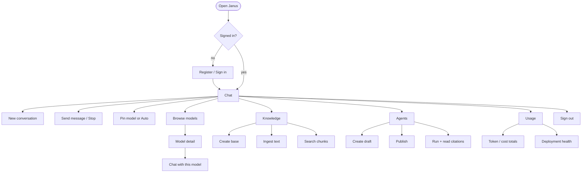

# Janus UI — customer presentation

**Status:** as-built product UI · **Last updated:** 2026-08-14  
**Live demo:** local `http://localhost:$JANUS_WEB_PORT` (see `.env`; often `3010` / `3011` on this Spark host, or `3000` by default)

## Visual mockups (open these for the deck)

**[ui-mockups/index.html](./ui-mockups/index.html)** — browser-framed screens that reuse the real product CSS (`globals.css`) and the same layout/classes as `apps/web`. Open the file in Chrome/Firefox for a sales walkthrough; sticky tabs jump Sign in → Chat → Models → Detail → Knowledge → Agents → Usage.

**JPEG screenshots** (ready for slides): [ui-mockups/screenshots/](./ui-mockups/screenshots/) — `sign-in.jpg`, `chat.jpg`, `models.jpg`, `model-detail.jpg`, `knowledge.jpg`, `agents.jpg`, `usage.jpg`.

```bash
# headless Spark: serve and open from your laptop
cd docs/ui-mockups && python3 -m http.server 8765 --bind 0.0.0.0
```

Related: [sales.md](./sales.md) · [architecture.md](./architecture.md) · [api.md](./api.md) · [ui-mockups/README.md](./ui-mockups/README.md)

---

## 1. Product surface at a glance

Five primary places after sign-in, always reachable from the top bar:

| Nav | Route | Job |
|-----|-------|-----|
| **Chat** | `/` | Daily conversations with streaming answers + model attribution |
| **Models** | `/models` | Browse what this org is allowed to use |
| **Agents** | `/agents` | Create, publish, and run governed agents |
| **Knowledge** | `/knowledge` | Ingest text, search with scores |
| **Usage** | `/usage` | Token/cost totals + deployment health |

Top-right always shows: **organization name**, **execution mode badge** (e.g. `auto mode`), **Sign out**.

---

## 2. Demo narrative (10 minutes)

Use this order with a prospect:

1. **Register** a workspace → show org + mode badge  
2. **Chat** with Auto → point at “which model answered” while it streams  
3. **Models** → open a model → “Chat with this model”  
4. **Knowledge** → paste a short policy → search  
5. **Agents** → attach that KB → run → show citations  
6. **Usage** → requests/tokens + deployments (no secret endpoints)  

---

## 3. Sign in / register

**Route:** any protected page when logged out · **Mockup:** [Sign in](./ui-mockups/index.html#sign-in)

### Actions

| Action | Result |
|--------|--------|
| Create workspace | User + organization; becomes **owner**; session cookie (HttpOnly) |
| Sign in | Resume existing org context |
| Switch login ↔ register | Same card, no separate marketing site required |

**Talking point:** No provider API keys in the browser. Session stays on the Janus origin; `/api/*` is proxied server-side.

---

## 4. Chat

**Route:** `/` · optional `?c=<conversation_id>` · optional `?model=<slug>` · **Mockup:** [Chat](./ui-mockups/index.html#chat)

### Actions

| Action | What happens |
|--------|----------------|
| **New chat** | Creates a conversation; URL updates to `?c=cnv_…` |
| **Select thread** | Loads persisted messages for that conversation |
| **Pick suggestion chip** | Fills composer (or sends — same intent: start fast) |
| **Choose model** | `Auto` or pin a catalog model for this turn |
| **Send** | Persists user message; streams assistant SSE; shows routing badge mid-stream |
| **Stop** | Cancels in-flight generation (best-effort) |
| **Read attribution** | Model slug, privacy (e.g. local), human-readable routing explanation |
| **Deep-link from Models** | `/?model=janus/…` pre-selects that model |

**Talking points**

- Answers are **labeled with the model that produced them** — not a black box.  
- History is **per organization**, not lost when the tab closes.  
- Auto mode still goes through the same policy as an explicit pin.

---

## 5. Models (catalog)

**Route:** `/models` · **Mockup:** [Models](./ui-mockups/index.html#models)

### Actions

| Action | Result |
|--------|--------|
| **Browse cards** | Only models eligible under current org mode/policy |
| **Open a card** | Model detail page |

---

## 6. Model detail

**Route:** `/models/[...id]` e.g. `/models/janus/mock-small` · **Mockup:** [Model detail](./ui-mockups/index.html#model-detail)

### Actions

| Action | Result |
|--------|--------|
| **Back to catalog** | `/models` |
| **Inspect deployments** | Key, privacy, availability, accelerator — **never** internal endpoints |
| **Chat with this model** | Jumps to Chat with that model pre-selected |

**Talking point:** Same eligibility rules as routing — the catalog cannot advertise a model the org cannot use.

---

## 7. Knowledge

**Route:** `/knowledge` · **Mockup:** [Knowledge](./ui-mockups/index.html#knowledge)

### Actions

| Action | Result |
|--------|--------|
| **Create knowledge base** | Named KB; embedding model pinned (default `janus/mock-embed`) |
| **Select a KB** | Target for ingest/search |
| **Upload files** | One or more `.txt` `.md` `.csv` `.json` `.html` `.pdf` `.docx`; text extracted then chunked |
| **Ingest pasted text** | Same pipeline as files; duplicate content rejected |
| **Search** | Ranked chunks with similarity scores |

**Talking points**

- Grounding for agents; citations come from these chunks.  
- Org-isolated (RLS). Paste text or upload files. PDFs need a selectable text layer (no OCR).

---

## 8. Agents

**Route:** `/agents` · **Mockup:** [Agents](./ui-mockups/index.html#agents)

### Actions

| Action | Result |
|--------|--------|
| **Create draft** | Versioned agent; optional KB + tools (`knowledge_search`, `clock`) |
| **Select agent** | Focus for publish/run |
| **Publish** | Marks version published (immutable publish semantics) |
| **Run** | Retrieve → tools → compose via **gateway**; shows status, steps, output, citations |

**Talking points**

- Agents never call a provider SDK; every model step hits the Model Gateway.  
- Citations prove grounding when knowledge is attached.

---

## 9. Usage & deployments

**Route:** `/usage` · **Mockup:** [Usage](./ui-mockups/index.html#usage)

### Actions

| Action | Result |
|--------|--------|
| **View usage** | Org-level totals from telemetry |
| **View deployments** | Health/privacy/accelerator the org can see — no credentials |

**Talking point:** Operators and buyers get transparency without exposing infrastructure endpoints.

---

## 10. Action map (all user intents)



---

## 11. Visual language (for designers / screenshots)

| Element | As built |
|---------|----------|
| Theme | Dark-first CSS variables; respects light preference |
| Brand | “J” mark + Janus wordmark in top bar |
| Density | Chat-first, not a multi-widget dashboard on first paint |
| Trust cues | Mode badge, privacy badges, verified metadata, routing explanation |
| What you never show | Provider keys, internal URLs, chain-of-thought |

**Preferred screenshots:** use [ui-mockups/index.html](./ui-mockups/index.html) (same CSS as production) or the live stack. Deck order: register → Auto chat with attribution → model card → knowledge search → agent run with citation → usage table.

When product CSS changes, refresh the mockup stylesheet:

```bash
cp apps/web/src/app/globals.css docs/ui-mockups/janus.css
```

---

## 12. Honest scope for the deck

**In the UI today:** auth, chat + history, catalog/detail, agents, knowledge (paste or file upload), usage/deployments.  

**Not in the UI yet (do not show as screens):** SSO login, OCR for scanned PDFs, admin SSO/SCIM, full audit export console, GPU fleet console, Marketplace subscribe button inside the app.

Those belong in roadmap / services slides — not this UI tour.
