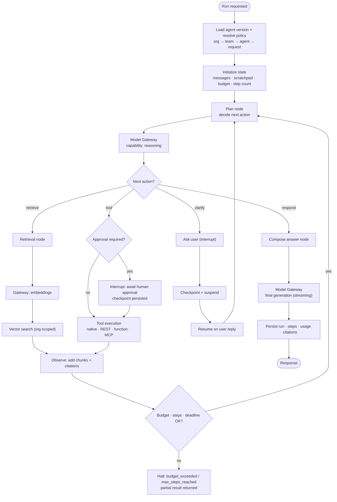
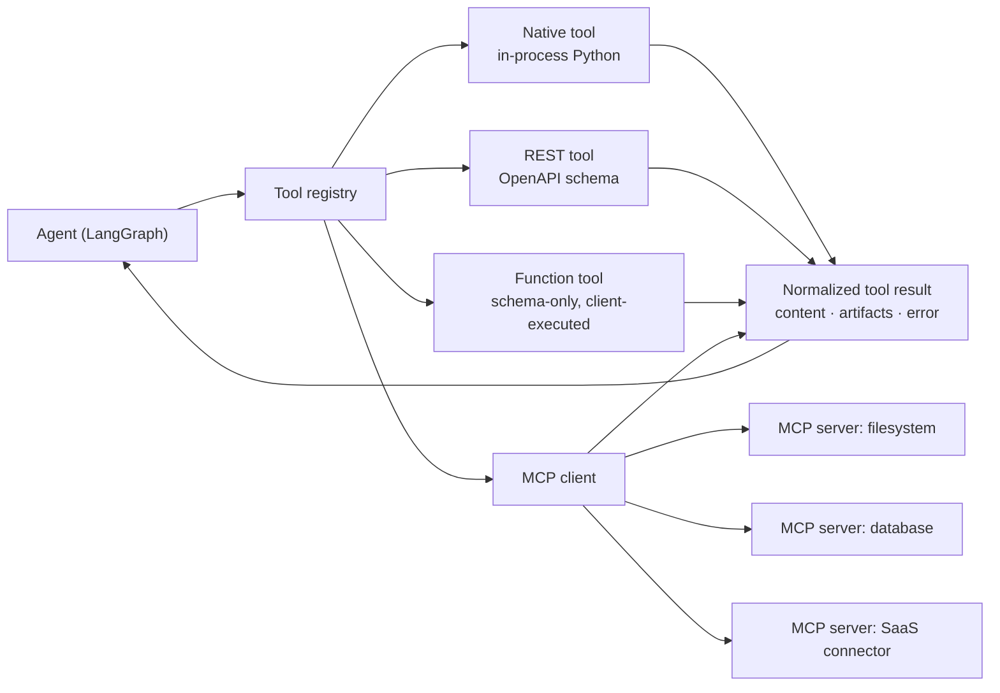
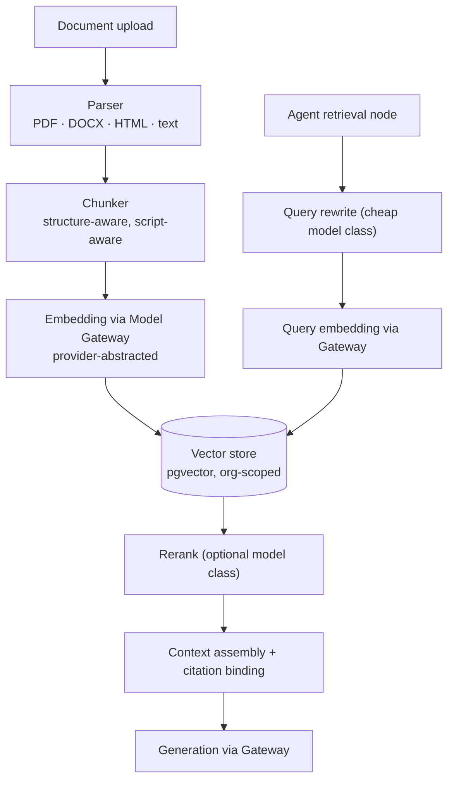

# Agents — Runtime Specification

**Status:** Draft for review (Phase 0) · **Component:** AI Runtime (LangGraph) · **Last updated:** 2026-08-13

An agent is a **versioned, permissioned configuration** — instructions, capabilities, tools, knowledge, and a model policy — executed by a LangGraph state machine that reaches models only through the Model Gateway.

Related: [architecture.md](./architecture.md) · [model-routing.md](./model-routing.md) · [model-gateway.md](./model-gateway.md) · [database.md](./database.md) · [security.md](./security.md)

---

## 1. Design position

| Decision | Rationale |
|----------|-----------|
| LangGraph for execution | Durable checkpointed state, interrupts, human-in-the-loop, replay — a hand-rolled loop would reinvent all of it |
| Graph nodes never name a provider | Routing, cost tracking, policy, fallback, and observability come free from the gateway |
| Agents are versioned, published artifacts | Reproducible runs; a run always references an immutable version |
| Tools are registry entries, not code branches | Native, REST, function, and MCP tools share one execution contract |
| Every step is persisted | Debuggability, audit, resumability, cost attribution |

Consequence: an agent definition is portable across infrastructure. The same agent runs on Sarvam cloud for one organization and on Janus-hosted private GPUs for another, unchanged.

---

## 2. Agent definition

```json
{
  "id": "agt_01JC…",
  "organization_id": "org_…",
  "slug": "legal-doc-analyst",
  "name": "Legal Document Analyst",
  "description": "Reviews Indian-language legal documents and produces structured summaries.",
  "version": 7,
  "status": "published",
  "instructions": "…system prompt…",
  "capabilities": {
    "reasoning": true,
    "tools": true,
    "web": false,
    "knowledge": true,
    "code": false,
    "vision": false
  },
  "model_policy": {
    "mode": "private",
    "selection": "auto",
    "preferred_models": ["sarvam-105b", "sarvam-30b", "janus/qwen-72b"],
    "min_capability": "reasoning",
    "weight_profile": "quality_first",
    "max_cost_usd_per_run": 0.50,
    "max_steps": 24,
    "step_overrides": {
      "planner": { "min_capability": "reasoning" },
      "tool_selection": { "weight_profile": "speed_first" },
      "summarize": { "selection": "auto" }
    }
  },
  "tools": [
    { "tool_id": "tol_…", "enabled": true, "approval": "auto" },
    { "tool_id": "tol_…", "enabled": true, "approval": "human_required" }
  ],
  "knowledge_bases": ["kb_…"],
  "memory": { "type": "conversation_summary", "max_tokens": 2000 },
  "visibility": "organization",
  "created_by": "usr_…"
}
```

### 2.1 Model policy semantics

| Field | Meaning |
|-------|---------|
| `mode` | Execution mode ceiling for this agent; may narrow the org mode, never widen it |
| `selection` | `auto` (router decides) or a model slug for pinning |
| `preferred_models` | Score bonus, not a hard constraint — availability still governs |
| `min_capability` | Hard requirement passed to the router |
| `max_cost_usd_per_run` | Enforced cumulatively across steps; exceeding it halts the run with a typed error |
| `max_steps` | Loop guard |
| `step_overrides` | Different node classes get different routing intent — planning wants quality, tool selection wants speed |

Per-step routing is what makes agents economically viable: a 24-step run does not need a frontier model for every step.

---

## 3. Execution graph



Every model call in this graph is a gateway call. The graph never chooses a provider.

### 3.2 State

```python
class AgentState(TypedDict):
    run_id: str
    organization_id: str
    agent_version_id: str
    messages: list[Message]          # conversation + tool results
    scratchpad: list[Step]           # internal reasoning artifacts — never returned to clients
    citations: list[Citation]
    budget: Budget                   # cost + tokens + steps + wall-clock consumed vs. limits
    resolved_policy: ResolvedPolicy   # snapshot for reproducibility
    pending_approval: ToolCall | None
```

`scratchpad` is internal-only: persisted for operators and audit, never serialized to a client, never included in a public API response ([security.md](./security.md#10-model-output-handling)).

---

## 4. Checkpointing and durability

| Property | Design |
|----------|--------|
| Checkpoint store | PostgreSQL (LangGraph checkpointer), keyed by `run_id`, org-scoped under RLS |
| Granularity | After every node transition |
| Resumability | A run interrupted by approval, clarification, deploy, or crash resumes from the last checkpoint |
| Retention | Configurable per organization; scratchpad has a shorter retention than results |
| Long runs | Executed by workers via SQS when they exceed interactive request lifetime |
| Idempotency | Tool calls carry idempotency keys so a resumed run does not double-execute side effects |

---

## 5. Tools

One execution contract for four tool kinds:



### 5.1 Tool record

```json
{
  "id": "tol_…",
  "organization_id": "org_…",
  "kind": "mcp",
  "name": "customer_db_query",
  "description": "Read-only queries against the customer database.",
  "input_schema": { "type": "object", "properties": { "sql": { "type": "string" } }, "required": ["sql"] },
  "mcp_server_id": "mcps_…",
  "side_effects": "read_only",
  "data_classification_max": "CONFIDENTIAL",
  "approval": "auto",
  "timeout_ms": 15000,
  "rate_limit": { "per_minute": 60 },
  "credentials_ref": "secretsmanager://janus/prod/orgs/org_…/tools/customer_db"
}
```

### 5.2 Tool governance

| Control | Rule |
|---------|------|
| Allow-listing | Only tools bound to the agent version can be called |
| Side-effect classification | `read_only` · `mutating` · `external_send`; mutating and external-send default to human approval |
| Data classification ceiling | A tool cannot receive data above its `data_classification_max` |
| Credentials | Resolved server-side per organization; never placed in model context |
| Timeouts and rate limits | Enforced per tool; failures are typed results the agent can reason about |
| Injection resistance | Tool output is untrusted content, wrapped and marked as data — never merged into the system prompt |
| Audit | Every invocation records inputs (classification-aware redaction), outputs, latency, and approver |

MCP servers are registered per organization with explicit transport, auth, and scopes; a new integration adds a server record, not agent-runtime code.

---

## 6. Memory

| Type | Mechanism | Phase |
|------|-----------|-------|
| Conversation window | Recent messages within a token budget | 2 |
| Conversation summary | Rolling summary via a cheap model class | 5 |
| Knowledge retrieval | RAG over knowledge bases | 6 |
| Long-term user memory | Explicit, user-visible, editable, deletable facts | 10 |

Long-term memory is opt-in and inspectable. Silent accumulation of user facts is not acceptable.

---

## 7. RAG integration



Embedding providers are abstracted exactly like chat providers — Sarvam (if available), OpenAI, open-source, or local models are interchangeable. Ingestion runs in workers, never in the request path.

Constraint: an embedding model change requires **re-embedding**, so the embedding model id and version are recorded on every chunk and mixed-model search is refused ([database.md](./database.md#7-knowledge-and-retrieval)).

---

## 8. Agent authoring experience

Creation should feel like describing intent, not configuring infrastructure:

```text
Create Agent

What should this agent do?
┌──────────────────────────────────────────────────────┐
│ Review Indian-language legal documents and produce   │
│ structured summaries with citations.                 │
└──────────────────────────────────────────────────────┘

Intelligence          ● Auto   ○ Sarvam 105B   ○ Sarvam 30B   ○ Janus Private

Capabilities          ☑ Reasoning   ☑ Tools   ☐ Web   ☑ Knowledge   ☐ Code   ☐ Vision

Privacy               ○ Standard   ● Private   ○ Sovereign

Knowledge             [ Legal corpus ▾ ]        Tools  [ + Add tool ]

                                          [ Test ]  [ Create Agent ]
```

Selecting **Private** or **Sovereign** must be honest: the UI shows which deployments will actually serve the agent and warns if the organization's fleet cannot satisfy the mode.

---

## 9. Versioning, publishing, permissions

| Concern | Design |
|---------|--------|
| Draft vs. published | Edits create a draft; publishing freezes an immutable `AgentVersion` |
| Run binding | Every run references a version id — behavior is reproducible |
| Rollback | Republish a previous version; no data migration |
| Visibility | `private` (creator) · `team` · `organization` · `marketplace` (future) |
| Permissions | Separate rights to view, run, edit, and publish ([security.md](./security.md#5-authorization-model)) |
| Testing | Run a draft against saved test cases before publishing; results stored with the version |

### 9.1 Marketplace (design-only, Phase 10+)

Future publishing of agents (research, coding, finance, HR, legal, support, Indian-language assistant) requires: semantic versioning, install into an organization with policy re-resolution, explicit tool/knowledge permission grants at install time, provenance and review, and **no** implicit data sharing between publisher and installer. Design constraint now: agents must be serializable to a portable definition with no embedded credentials.

---

## 10. Observability

Per run: `agent_runs` (agent version, policy snapshot, mode, totals, status) and `agent_steps` (node, model selection, tokens, cost, latency, tool calls, errors).

Operators can answer: what did this agent do, which models served each step, what did it cost, which tools ran, where did it stall, and why did it stop. Users see a clean step timeline without internal reasoning traces. Detail in [observability.md](./observability.md#5-agent-run-telemetry).

---

## 11. Failure semantics

| Failure | Behavior |
|---------|----------|
| Step model unavailable | Gateway fallback within policy; if exhausted, halt with `no_eligible_model` |
| Tool timeout / error | Typed result returned to the agent; bounded retries; then graceful degradation |
| Budget exceeded | Halt, return partial result, mark `budget_exceeded` |
| Max steps reached | Halt, return best available answer, mark `max_steps_reached` |
| Loop detected | Repetition heuristics halt the run |
| Policy violation attempt | Refuse, record, surface a clear reason — never silently downgrade privacy |
| Crash mid-run | Resume from last checkpoint |

Partial results are always returned with an explicit reason. Silent truncation is not acceptable.

---

## 12. Open questions

1. Should Phase 5 ship a general planner graph, or start with a constrained ReAct-style loop and add planning in Phase 10?
2. Default approval posture for `mutating` tools — human approval required, or organization-configurable with a safe default?
3. Where do agent runs execute in Phase 5: inline in `janus-api` (Option A of [architecture.md §4.3](./architecture.md#43-runtime-deployment-options)) or already on workers?
4. Do we support multi-agent delegation (agent calling agent) in Phase 10, and how are budgets and policies inherited?
5. Retention defaults for scratchpad and checkpoints — how long is debuggability worth the privacy cost?
