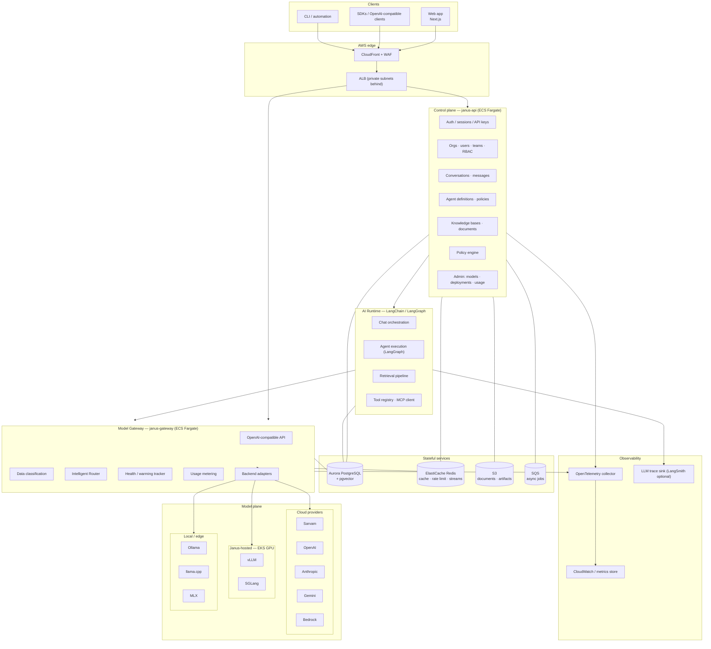
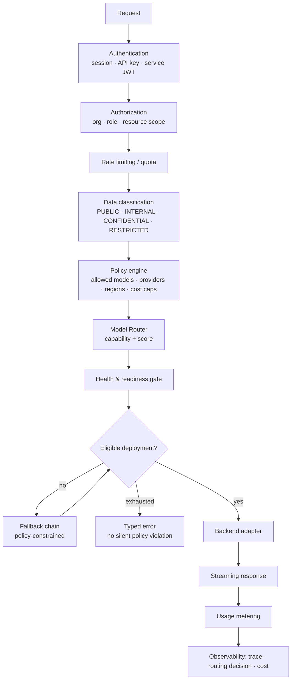
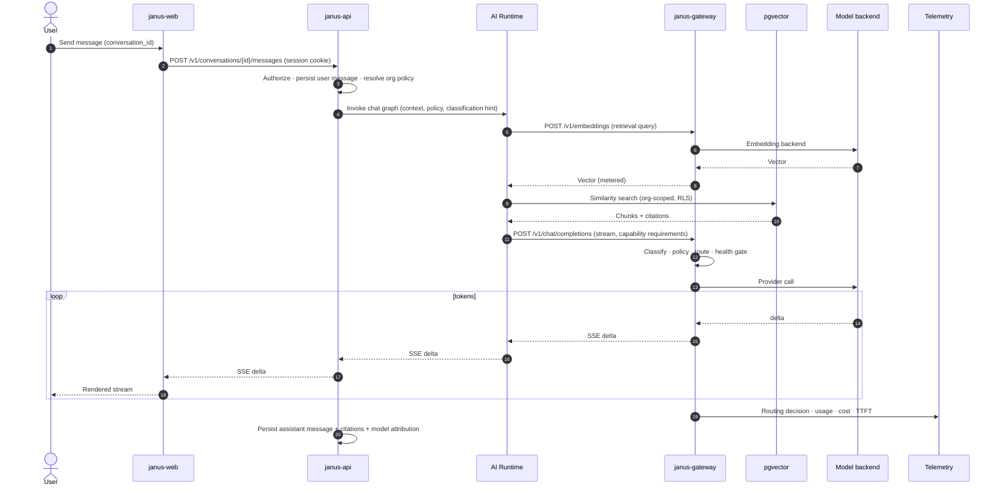
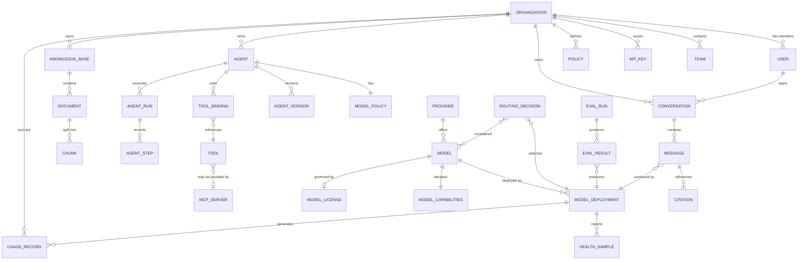

# Architecture — Janus Intelligence

**Status:** Draft for review (Phase 0) · **Owner:** Principal Architect · **Last updated:** 2026-08-13

Companion documents: [model-gateway.md](./model-gateway.md) · [model-routing.md](./model-routing.md) · [agents.md](./agents.md) · [database.md](./database.md) · [api.md](./api.md) · [security.md](./security.md) · [aws.md](./aws.md) · [observability.md](./observability.md) · [roadmap.md](./roadmap.md)

---

## 1. What Janus is

Janus Intelligence is an **AI operating platform**: a single interface over many models, deployments, agents, and knowledge sources. The product surface is chat and agents; the durable engineering asset is the **Model Gateway** and the **Intelligent Router** beneath it.

### 1.1 Design goals

| Goal | Meaning | Enforced by |
|------|---------|-------------|
| Provider independence | Swapping Sarvam → OpenAI → self-hosted Llama is configuration, not code | `ModelBackend` interface, registry-driven config ([model-gateway.md](./model-gateway.md#3-backend-abstraction)) |
| Deployment neutrality | Cloud, Janus GPU, and local inference look identical to callers | OpenAI-compatible internal protocol |
| Policy before inference | Data classification and org policy decided **before** a provider is chosen | Gateway pipeline stage order ([§5](#5-request-pipeline)) |
| Explainable routing | Every request records why a model was chosen | `routing_decisions` table ([observability.md](./observability.md#4-routing-decision-log)) |
| Tenant isolation | One organization can never read another's data | `organization_id` + Postgres RLS ([security.md](./security.md#6-multi-tenancy)) |
| Operational honesty | No fabricated benchmarks, no unsupported privacy claims | Evaluation harness gates published numbers |

### 1.2 Non-goals for Phase 1–3

Fine-tuning/training pipelines · full voice · image generation · agent marketplace monetization · on-premise customer installs · mobile apps.

---

## 2. System architecture



### 2.1 Deployable components

| Component | Name | Runtime | Responsibility |
|-----------|------|---------|----------------|
| Web | `janus-web` | Next.js on ECS Fargate | UI, SSR, BFF proxy. Holds **no** provider secrets |
| Control plane API | `janus-api` | FastAPI on ECS Fargate | Auth, orgs, conversations, agents, knowledge, admin |
| Model Gateway | `janus-gateway` | FastAPI on ECS Fargate | OpenAI-compatible inference surface, routing, metering |
| Workers | `janus-worker` | FastAPI-less Python on ECS | Ingestion, embeddings, evals, health probes, rollups |
| GPU serving | `janus-inference` | vLLM / SGLang on EKS | Janus-hosted open-weight models (Phase 8) |

Five components, each justified by a distinct scaling or security boundary. No further service decomposition without an ADR.

---

## 3. Layer contract

```text
UI / SDK
   │  authenticated user or API key
   ▼
Control plane (janus-api)          ← owns tenant data + policy definitions
   │  invokes runtime with resolved context
   ▼
AI Runtime (LangChain / LangGraph) ← orchestration only; never picks a provider
   │  OpenAI-compatible calls
   ▼
Model Gateway (janus-gateway)      ← security + policy + routing + metering boundary
   │  ModelBackend adapters
   ▼
Model plane (cloud / Janus GPU / local)
```

**Hard rules**

1. The runtime and all feature code call **only** the gateway for inference. No direct provider SDK use outside `janus-gateway` adapters.
2. LangGraph nodes never name a provider. They request capabilities; the router decides ([model-routing.md](./model-routing.md)).
3. The web app never receives provider credentials, internal endpoints, or raw routing internals.
4. Provider credentials live in AWS Secrets Manager, loaded only by `janus-gateway`.

Violation of rule 1 or 4 is a release blocker.

---

## 4. AI Runtime

The runtime turns a user or agent request into a sequence of model, tool, and retrieval calls.

### 4.1 Responsibilities

| Concern | Owner |
|---------|-------|
| Prompt assembly, message windowing, system prompt versioning | Runtime |
| Tool selection and execution loop | Runtime (LangGraph) |
| Retrieval (query rewriting, search, reranking, citations) | Runtime |
| Model choice, provider credentials, fallback, metering | **Gateway** |
| Conversation persistence | Control plane |

### 4.2 Why LangChain and LangGraph

LangChain provides adapters, message types, and streaming primitives. LangGraph provides durable, inspectable state machines for multi-step agents — checkpointing, interrupts, and human-in-the-loop, which a hand-rolled loop would have to reinvent.

Both are used through a thin internal facade (`packages/janus-runtime`) so a future migration does not touch feature code.

### 4.3 Runtime deployment options

**Decision pending.** Two candidates:

| Option | Pros | Cons |
|--------|------|------|
| **A — library inside `janus-api`** (recommended for Phase 1–5) | Fewer moving parts, simpler local dev, no extra hop | Long agent runs occupy API capacity |
| B — separate `janus-runtime` service | Independent scaling for long agent runs | Extra service, extra latency, more IAM surface |

Recommendation: start with **A**, extract to **B** when agent runs exceed request-lifetime limits or need separate autoscaling. Trigger condition and migration path recorded in [adr/0004-ai-runtime-boundary.md](./adr/0004-ai-runtime-boundary.md).

---

## 5. Request pipeline

Every inference request traverses the same ordered stages. Order is normative: classification and policy precede routing, so a provider is never selected for data it is not allowed to see.



Failure semantics: if the policy-constrained fallback chain is exhausted, Janus returns a typed error (`no_eligible_model`) explaining the constraint class. It **never** relaxes a privacy or region constraint to complete a request. See [model-routing.md](./model-routing.md#7-fallback).

---

## 6. Data flow — chat turn with retrieval



Cancellation propagates the full length of the chain; partial output and partial usage are still recorded.

---

## 7. Domain model



### 7.1 Aggregate boundaries

| Aggregate | Root | Notes |
|-----------|------|-------|
| Tenancy | `Organization` | Every tenant-scoped row carries `organization_id` |
| Conversation | `Conversation` | Messages immutable once complete; edits create new messages |
| Agent | `Agent` | Published versions immutable; runs reference a version |
| Knowledge | `KnowledgeBase` | Documents and chunks lifecycle-bound to the base |
| Model catalog | `Model` | **Platform-scoped**, not tenant-scoped; visibility filtered by policy |
| Model deployment | `ModelDeployment` | Physical endpoint of a model; carries privacy/region |
| Accounting | `UsageRecord` | Append-only; source of truth for cost and quota |

The model catalog being platform-scoped with per-org **visibility** (rather than per-org copies) is a deliberate choice: one registry, many policies. See [model-registry.md](./model-registry.md).

### 7.2 Identifier convention

Prefixed, sortable identifiers (UUIDv7 or ULID payload) — readable in logs, safe in URLs:

```text
org_…  usr_…  team_…  key_…  cnv_…  msg_…  agt_…  run_…  stp_…
kb_…   doc_…  chk_…   mdl_…  dep_…  pol_…  evl_…  rq_…   dec_…
```

Model **slugs** are separate from `mdl_` primary keys and are what users and API callers see: `sarvam-105b`, `janus/llama-70b`. Deployment-qualified form: `sarvam-105b@janus-gpu-use1`. Full grammar in [model-registry.md](./model-registry.md#3-identifier-grammar).

---

## 8. Execution modes

A single control surface for "where may inference happen", exposed to users as a mode and to policy as constraints.

| Mode | External providers | Janus-hosted | Local | Typical use |
|------|-------------------|--------------|-------|-------------|
| `auto` | allowed | allowed | allowed | Default consumer experience |
| `cloud` | allowed | allowed | — | Maximum capability |
| `private` | denied | allowed | allowed | Sensitive business data |
| `sovereign` | denied | allowed (region-pinned) | — | Regulated / data-residency |
| `offline` | denied | denied | allowed only | Air-gapped / laptop dev |

Mode is set per organization (ceiling), per agent, and per request (may only narrow, never widen). Resolution algebra in [security.md](./security.md#8-policy-resolution).

---

## 9. Technology choices

| Layer | Choice | Rationale | Rejected |
|-------|--------|-----------|----------|
| Web | Next.js + TypeScript + Tailwind | Streaming SSR, mature ecosystem, team familiarity | SPA-only; Streamlit |
| API | Python 3.12 + FastAPI + Pydantic v2 | Async streaming, typed contracts, same language as AI ecosystem | Node API (splits AI tooling), Go (loses LangChain) |
| Orchestration | LangChain + LangGraph behind a facade | Durable agent state, adapter breadth | Hand-rolled agent loop |
| Database | Aurora PostgreSQL 16 + pgvector | One store for relational + vectors at Phase-6 scale; RLS for tenancy | Separate vector DB on day one |
| Cache / limits | ElastiCache Redis | Rate limits, health cache, stream fan-out | In-process only |
| Async | SQS + workers | Ingestion, evals, rollups | Celery+RabbitMQ (extra ops) |
| Core compute | ECS Fargate | No cluster ops for stateless services | EKS for everything |
| GPU compute | EKS + GPU node groups (Phase 8) | Device plugins, autoscaling, model controllers genuinely need K8s | GPU on ECS; SageMaker-only |
| IaC | Terraform | Team standard, multi-account | CDK, console |
| Telemetry | OpenTelemetry → CloudWatch/OTLP backend | Vendor-neutral traces and metrics | Provider-specific SDKs only |

Kubernetes is introduced **only** for GPU serving, and only when Janus actually hosts models — see [aws.md](./aws.md#7-why-hybrid-ecs--eks).

---

## 10. Environments

| Environment | Purpose | Model plane |
|-------------|---------|-------------|
| `local` | Developer laptop / DGX Spark | Ollama, MLX, llama.cpp, **mock backend** |
| `dev` | Shared integration | Cloud providers (dev keys) + mock |
| `staging` | Pre-production, full Terraform parity | Cloud + one small Janus GPU deployment |
| `prod` | Customer traffic | All planes |

Local development must not require AWS GPU infrastructure. A `mock` backend with deterministic outputs backs automated tests, so CI never calls a paid provider. See [model-gateway.md](./model-gateway.md#9-local-development-and-testing).

---

## 11. Cross-cutting concerns

| Concern | Approach | Detail |
|---------|----------|--------|
| Configuration | Typed settings objects, env-injected; no literals in code | [security.md](./security.md#4-secrets) |
| Secrets | AWS Secrets Manager; gateway-only provider keys | [security.md](./security.md#4-secrets) |
| Dependency injection | FastAPI dependencies + explicit factories; no global singletons | — |
| Errors | Typed error taxonomy, stable machine-readable codes | [api.md](./api.md#9-error-model) |
| Idempotency | `Idempotency-Key` on mutating inference calls | [api.md](./api.md#8-idempotency-and-retries) |
| Timeouts / retries | Per-backend budgets; jittered retries; circuit breakers | [model-gateway.md](./model-gateway.md#7-resilience) |
| Streaming | SSE end-to-end; cancellation propagates | [api.md](./api.md#7-streaming) |
| Migrations | Alembic, forward-only, reviewed | [database.md](./database.md#10-migrations) |
| Chain-of-thought | Never returned to clients or stored in message bodies | [security.md](./security.md#10-model-output-handling) |

---

## 12. Architectural risks

| Risk | Impact | Mitigation |
|------|--------|------------|
| Gateway becomes a latency bottleneck | Slower TTFT than calling providers directly | Keep gateway stateless, cache registry/health in Redis, measure TTFT overhead with a per-release budget (target < 25 ms p95 added) |
| Gateway is a single point of failure | Platform-wide outage | Multi-AZ, no local state, health-based fallback, provider-independent failure domains |
| Router complexity outpaces explainability | "Why this model?" unanswerable | Decision log with candidate set and score components from day one |
| Provider abstraction leaks (tool calling, thinking modes, structured output differ) | `if provider ==` creeps back | Capability negotiation + adapter conformance test suite |
| GPU cost | Idle expensive hardware | Scale-to-zero with warm pools, batch pool separation, cost dashboards per deployment |
| pgvector outgrown | Retrieval latency | Abstract the retriever interface now; migration path in [database.md](./database.md#8-vector-storage-decision-pending) |
| Sarvam assumptions incorrect | Registry seed and routing tiers wrong | Verify before Phase 2; registry is data-driven so correction is config |

---

## 13. Decision log (summary)

| # | Decision | Status |
|---|----------|--------|
| 0001 | Model Gateway is the sole inference path and a security boundary | Proposed |
| 0002 | OpenAI-compatible protocol as internal and external lingua franca | Proposed |
| 0003 | Hybrid ECS (core) + EKS (GPU only) | Proposed |
| 0004 | AI Runtime starts as a library in `janus-api` | Proposed |
| 0005 | Shared-schema multi-tenancy with Postgres RLS | Proposed |
| 0006 | Aurora PostgreSQL + pgvector for Phase 6 retrieval | Proposed |
| 0007 | Platform-scoped model registry with per-org visibility policies | Proposed |

Records: [adr/](./adr/).

---

## 14. Open questions

1. **Runtime boundary** — accept Option A (library) for Phase 1–5, or split immediately?
2. **Primary region and data residency** — is an India region required at launch for sovereign mode, and is it primary or secondary?
3. **Identity provider** — build local auth first, or start with an external IdP (Cognito/Auth0/WorkOS) for SSO?
4. **Vector store** — commit to pgvector through Phase 6, or design for OpenSearch from the start?
5. **Cost attribution granularity** — per organization, per user, per conversation, or per agent run?
6. **Sarvam contract** — API rate limits and self-hosting license terms, needed to finalize routing tiers.
