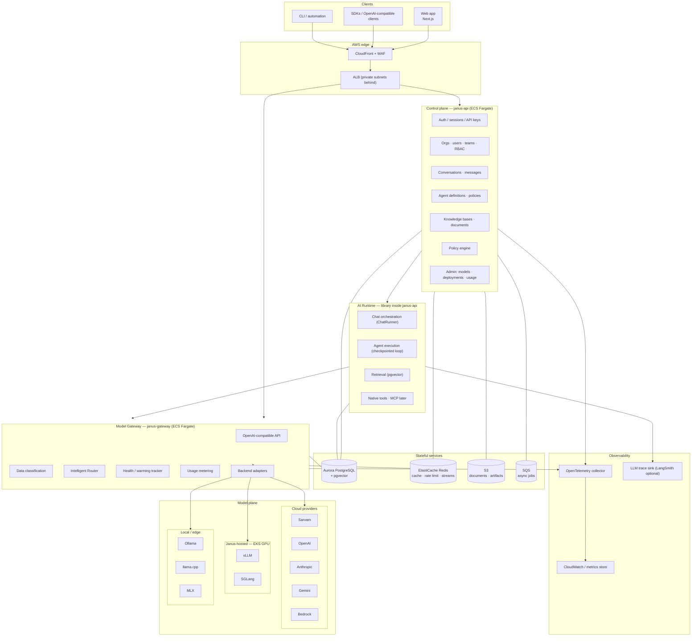
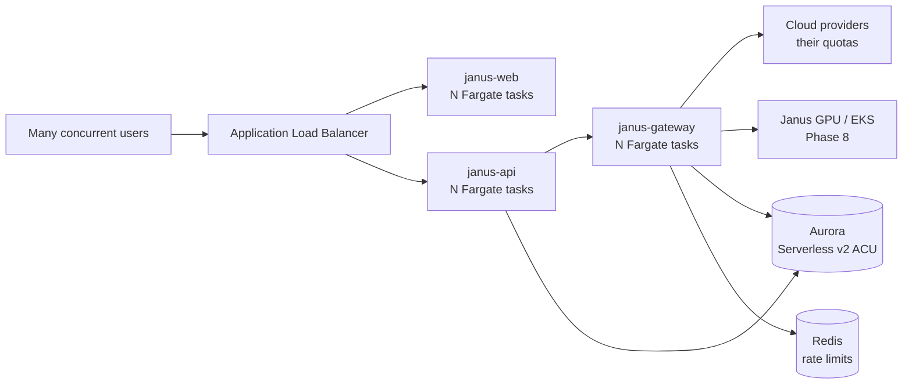
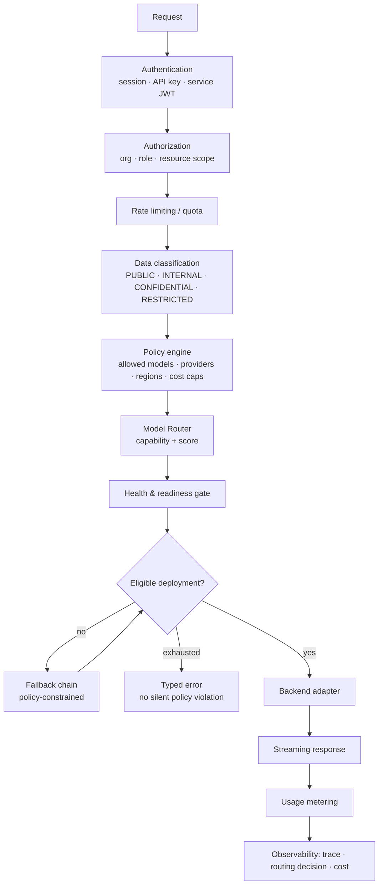
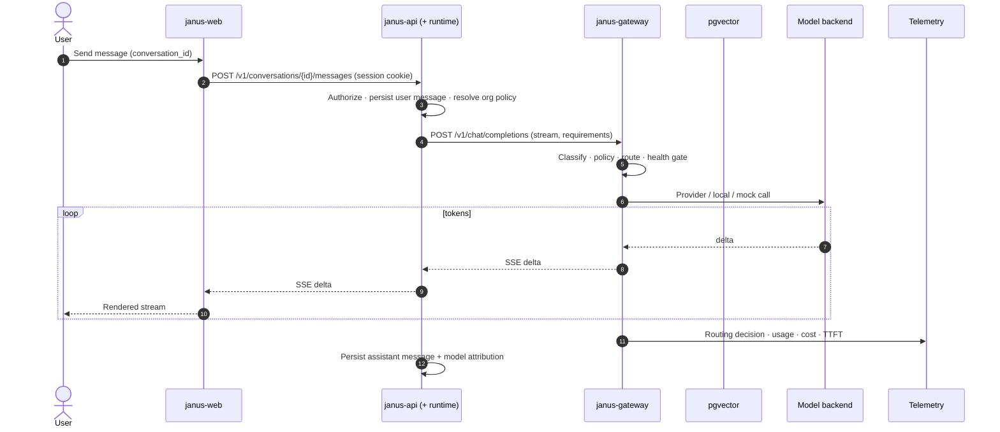
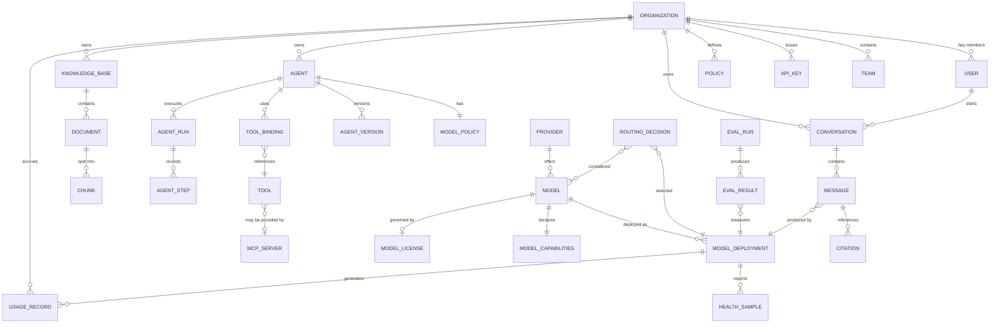

# Architecture — Janus Intelligence

**Status:** Living architecture (Phases 0–10 as-built slices) · **Owner:** Principal Architect · **Last updated:** 2026-08-14

Companion documents: [model-gateway.md](./model-gateway.md) · [model-routing.md](./model-routing.md) · [agents.md](./agents.md) · [database.md](./database.md) · [api.md](./api.md) · [security.md](./security.md) · [aws.md](./aws.md) · [aws-deploy.md](./aws-deploy.md) · [observability.md](./observability.md) · [roadmap.md](./roadmap.md)

**Read this for:** what the product is, how a request moves through the system, and how the AWS deployment absorbs load. Detail for each plane lives in the companions above.

---

## 1. What Janus is

Janus Intelligence is an **AI operating platform**: a single interface over many models, deployments, agents, and knowledge sources. The product surface is chat and agents; the durable engineering asset is the **Model Gateway** and the **Intelligent Router** beneath it.

### 1.0 Market position

The launch market is the **United States**, mass-market first: individual and team users who want a fast, polished assistant, and companies that need the same assistant without sending confidential data to a third-party provider.

| Consequence for architecture | Detail |
|------------------------------|--------|
| Primary region is US | `us-east-1` primary, `us-west-2` secondary; other regions added as markets open ([aws.md](./aws.md#6-environments-and-accounts)) |
| Frontier models lead the catalog | OpenAI, Anthropic, Gemini, and Bedrock are the default quality tier for US users |
| Private tier is the enterprise wedge | Janus-hosted open-weight models on Janus GPUs, so `private` mode is a real product, not a promise |
| Compliance targets are US-oriented | SOC 2 first, then HIPAA and FedRAMP-adjacent requirements as demand appears ([security.md](./security.md#13-privacy-and-compliance-posture)) |
| Multilingual is a differentiator, not the premise | Sarvam remains a first-class provider and gives Janus unusually strong Indic coverage; it is an expansion advantage, not the launch pitch |

Nothing in the architecture is US-specific: regions, providers, and residency are configuration, so opening a second geography is a deployment exercise rather than a redesign.

### 1.1 Design goals

| Goal | Meaning | Enforced by |
|------|---------|-------------|
| Provider independence | Swapping Sarvam → OpenAI → self-hosted Llama is configuration, not code | `ModelBackend` interface, registry-driven config ([model-gateway.md](./model-gateway.md#3-backend-abstraction)) |
| Deployment neutrality | Cloud, Janus GPU, and local inference look identical to callers | OpenAI-compatible internal protocol |
| Policy before inference | Data classification and org policy decided **before** a provider is chosen | Gateway pipeline stage order ([§5](#5-request-pipeline)) |
| Explainable routing | Every request records why a model was chosen | `routing_decisions` table ([observability.md](./observability.md#4-routing-decision-log)) |
| Tenant isolation | One organization can never read another's data | `organization_id` + Postgres RLS ([security.md](./security.md#6-multi-tenancy)) |
| Operational honesty | No fabricated benchmarks, no unsupported privacy claims | Evaluation harness gates published numbers |

### 1.2 Non-goals for Phase 1–3

Fine-tuning/training pipelines · full voice · image generation · agent marketplace monetization · on-premise customer installs · mobile apps.

---

## 2. System architecture



### 2.1 Deployable components

| Component | Name | Runtime | Responsibility |
|-----------|------|---------|----------------|
| Web | `janus-web` | Next.js on ECS Fargate | UI, SSR, BFF proxy. Holds **no** provider secrets |
| Control plane API | `janus-api` | FastAPI on ECS Fargate | Auth, orgs, conversations, agents, knowledge, admin |
| Model Gateway | `janus-gateway` | FastAPI on ECS Fargate | OpenAI-compatible inference surface, routing, metering |
| Workers | `janus-worker` | FastAPI-less Python on ECS | Ingestion, embeddings, evals, health probes, rollups |
| GPU serving | `janus-inference` | vLLM / SGLang on EKS | Janus-hosted open-weight models (Phase 8) |

Five components, each justified by a distinct scaling or security boundary. No further service decomposition without an ADR.

### 2.2 Overall workflow

Janus is three planes plus a model plane. **Only the gateway talks to model providers.** Everything else is tenant data, orchestration, or UI.

```text
Browser / OpenAI SDK
        │
        ▼
   janus-web (optional)          session cookie; proxies /api/* → api
        │
        ▼
   janus-api                     auth · orgs · conversations · agents · knowledge
        │                        resolves org mode / classification
        │                        persists messages / agent runs
        ▼
   AI Runtime (in-process)       chat stream · agent retrieve→tool→compose loop
        │                        never imports a provider SDK
        ▼
   janus-gateway                 auth (jsk_ or service token) · rate limit
        │                        classify · policy · Auto router · health
        │                        meter · stream SSE
        ▼
   Model plane                   mock · Ollama · cloud APIs · (later) Janus GPU
```

| Product action | Path |
|----------------|------|
| **Chat turn** | Web → `POST /v1/conversations/{id}/messages` → ChatRunner → gateway `/v1/chat/completions` (SSE) → persist assistant message + attribution |
| **Programmatic chat** | Client → gateway (or api alias) `/v1/chat/completions` with `jsk_` key → same router → stream |
| **Agent run** | Web/API → `POST /v1/agents/{id}/runs` → optional knowledge retrieve → tools → gateway completion → checkpoints + citations |
| **Knowledge** | API ingest → chunk → gateway embeddings (or hash fallback) → pgvector → search / agent retrieve |
| **Catalog / usage** | API → gateway `/v1/models` (policy-filtered) · telemetry tables for usage |

Local compose and AWS both run the same three services (`web`, `api`, `gateway`) against Postgres (+ Redis on AWS / full stack). The difference is who operates the boxes, not the call graph.

### 2.3 Serverless compute — and how it scales under load

**“Serverless” here means ECS Fargate:** you ship containers; AWS runs the hosts. There are no EC2 instances to patch for the core plane, and no Lambda request-response model. Long-lived **SSE streams** need containers behind an ALB, not short-lived functions.



| Layer | What absorbs load | What happens when load rises |
|-------|-------------------|------------------------------|
| **Edge** | ALB (optional CloudFront + WAF later) | Spreads connections across healthy tasks; health checks remove bad tasks |
| **Web** | Stateless Next.js tasks | Scale on CPU / request count. Browser only needs the web origin; API is proxied |
| **API** | Stateless FastAPI tasks | Scale on CPU / ALB requests. Holds chat and agent orchestration in-process ([ADR 0004](./adr/0004-ai-runtime-boundary.md)) |
| **Gateway** | Stateless FastAPI tasks | Scale primarily on **active streams** (I/O-bound), not CPU alone. Each stream holds a connection for the whole generation |
| **Postgres** | Aurora Serverless v2 (staging Terraform) or provisioned + readers in prod design | ACUs / instances grow with connections and query load; RLS stays per-connection |
| **Redis** | ElastiCache | Shared rate limits and cache so extra gateway tasks do not invent separate quotas |
| **Model plane** | Provider APIs or Janus GPU | **Usually the real ceiling.** Cloud providers enforce RPM/TPM; Janus GPUs add replicas / node pools (Phase 8). The gateway falls back only within policy |

**What does *not* scale by adding Fargate tasks alone**

1. A single provider’s rate limit — more gateway tasks just hit the same quota faster unless keys and policies are split.
2. One Aurora writer under a write-heavy storm — readers help reporting; chat writes still need headroom and pooling.
3. A pinned deployment that is `warming` / `offline` — the router excludes it; load shifts to eligible deployments or returns `no_eligible_model`.
4. Agent runs that occupy an API worker for many gateway round-trips — under extreme agent concurrency, extract the runtime to its own service (ADR 0004 trigger).

**Protection under overload**

- Per-org **rate limits** on the gateway (Redis when shared, in-process otherwise).
- **Bulkheads** — bounded concurrency per deployment so one slow backend cannot exhaust the gateway.
- **Health-based routing** — degraded / offline deployments are deprioritized or excluded.
- **Load shedding** — typed errors with `Retry-After` rather than unbounded queues (design; tune from SLOs).
- **Multi-AZ** Fargate + Aurora so a single AZ loss does not take the product down.

**Honesty about the Terraform in `infra/aws` today:** services start at a fixed `desired_count`. Target autoscaling (ALB request count, CPU, custom `janus.streams.active`) is specified in [aws.md §2](./aws.md#2-core-platform-on-ecs-fargate) and should be enabled before production traffic. Scaling *mechanically* is Fargate task count + Aurora capacity + Redis + provider/GPU capacity — not a single knob.

---

## 3. Layer contract

```text
UI / SDK
   │  authenticated user or API key
   ▼
Control plane (janus-api)          ← owns tenant data + policy definitions
   │  invokes runtime with resolved context
   ▼
AI Runtime (library in janus-api)  ← orchestration only; never picks a provider
   │  OpenAI-compatible calls
   ▼
Model Gateway (janus-gateway)      ← security + policy + routing + metering boundary
   │  ModelBackend adapters
   ▼
Model plane (cloud / Janus GPU / local)
```

**Hard rules**

1. The runtime and all feature code call **only** the gateway for inference. No direct provider SDK use outside `janus-gateway` adapters.
2. Agent / chat steps never name a provider. They request capabilities (or `auto`); the router decides ([model-routing.md](./model-routing.md)).
3. The web app never receives provider credentials, internal endpoints, or raw routing internals.
4. Provider credentials live in AWS Secrets Manager, loaded only by `janus-gateway`.

Violation of rule 1 or 4 is a release blocker.

---

## 4. AI Runtime

The runtime turns a user or agent request into a sequence of model, tool, and retrieval calls. It lives **inside `janus-api`** as application code (not a separate service).

### 4.1 Responsibilities

| Concern | Owner |
|---------|-------|
| Prompt assembly, message windowing, system prompt versioning | Runtime |
| Tool selection and execution loop | Runtime (checkpointed retrieve → tool → compose loop today) |
| Retrieval (chunk search, citations) | Runtime + pgvector |
| Model choice, provider credentials, fallback, metering | **Gateway** |
| Conversation persistence | Control plane |

### 4.2 As-built vs design target

| Today | Design target (docs / ADR 0004) |
|-------|----------------------------------|
| Custom agent loop in `api_app/agents.py` with Postgres checkpoints | Optional LangGraph (or equivalent) facade if interrupts / resume / HITL need a graph engine |
| ChatRunner streams via the gateway | Unchanged |
| No LangChain / LangSmith in the monorepo | LangSmith remains an *optional* LLM-trace sink for orgs that accept an external processor ([observability.md](./observability.md)) |

Framework choice must not weaken ADR 0001: orchestration may use libraries; **inference still goes only through the gateway**.

### 4.3 Runtime deployment

**Accepted for Phases 1–6:** library inside `janus-api` ([adr/0004-ai-runtime-boundary.md](./adr/0004-ai-runtime-boundary.md)).

Extract to a separate `janus-runtime` service when agent runs exceed request-lifetime limits or force API autoscaling that harms chat latency.

---

## 5. Request pipeline

Every inference request traverses the same ordered stages. Order is normative: classification and policy precede routing, so a provider is never selected for data it is not allowed to see.



Failure semantics: if the policy-constrained fallback chain is exhausted, Janus returns a typed error (`no_eligible_model`) explaining the constraint class. It **never** relaxes a privacy or region constraint to complete a request. See [model-routing.md](./model-routing.md#7-fallback).

---

## 6. Data flow — chat turn with retrieval

Chat persistence and streaming run in `janus-api`. The “AI Runtime” participant below is **in-process** (ChatRunner / agent loop), not a separate network hop.



Agent runs that use knowledge add a retrieve step (embeddings via the gateway, similarity search under RLS) before the compose completion — same gateway boundary.

Cancellation propagates the full length of the chain; partial output and partial usage are still recorded.

---

## 7. Domain model



### 7.1 Aggregate boundaries

| Aggregate | Root | Notes |
|-----------|------|-------|
| Tenancy | `Organization` | Every tenant-scoped row carries `organization_id` |
| Conversation | `Conversation` | Messages immutable once complete; edits create new messages |
| Agent | `Agent` | Published versions immutable; runs reference a version |
| Knowledge | `KnowledgeBase` | Documents and chunks lifecycle-bound to the base |
| Model catalog | `Model` | **Platform-scoped**, not tenant-scoped; visibility filtered by policy |
| Model deployment | `ModelDeployment` | Physical endpoint of a model; carries privacy/region |
| Accounting | `UsageRecord` | Append-only; source of truth for cost and quota |

The model catalog being platform-scoped with per-org **visibility** (rather than per-org copies) is a deliberate choice: one registry, many policies. See [model-registry.md](./model-registry.md).

### 7.2 Identifier convention

Prefixed, sortable identifiers (UUIDv7 or ULID payload) — readable in logs, safe in URLs:

```text
org_…  usr_…  team_…  key_…  cnv_…  msg_…  agt_…  run_…  stp_…
kb_…   doc_…  chk_…   mdl_…  dep_…  pol_…  evl_…  rq_…   dec_…
```

Model **slugs** are separate from `mdl_` primary keys and are what users and API callers see: `sarvam-105b`, `janus/llama-70b`. Deployment-qualified form: `sarvam-105b@janus-gpu-use1`. Full grammar in [model-registry.md](./model-registry.md#3-identifier-grammar).

---

## 8. Execution modes

A single control surface for "where may inference happen", exposed to users as a mode and to policy as constraints.

| Mode | External providers | Janus-hosted | Local | Typical use |
|------|-------------------|--------------|-------|-------------|
| `auto` | allowed | allowed | allowed | Default consumer experience |
| `cloud` | allowed | allowed | — | Maximum capability |
| `private` | denied | allowed | allowed | Sensitive business data |
| `sovereign` | denied | allowed (region-pinned) | — | Regulated / data-residency |
| `offline` | denied | denied | allowed only | Air-gapped / laptop dev |

Mode is set per organization (ceiling), per agent, and per request (may only narrow, never widen). Resolution algebra in [security.md](./security.md#8-policy-resolution).

---

## 9. Technology choices

| Layer | Choice | Rationale | Rejected |
|-------|--------|-----------|----------|
| Web | Next.js + TypeScript + Tailwind | Streaming SSR, mature ecosystem, team familiarity | SPA-only; Streamlit |
| API | Python 3.12 + FastAPI + Pydantic v2 | Async streaming, typed contracts, same language as AI ecosystem | Node API (splits AI tooling) |
| Orchestration | In-process runtime in `janus-api` (checkpointed agent loop); LangGraph optional later | Matches ADR 0004; gateway remains sole inference path | Provider SDKs in feature code |
| Database | Aurora PostgreSQL 16 + pgvector | One store for relational + vectors at Phase-6 scale; RLS for tenancy | Separate vector DB on day one |
| Cache / limits | ElastiCache Redis | Rate limits, health cache, stream fan-out | In-process only |
| Async | SQS + workers (design; workers not yet required for the text RAG path) | Ingestion, evals, rollups | Celery+RabbitMQ (extra ops) |
| Core compute | **ECS Fargate** (serverless containers) | No cluster ops for stateless services; scales by task count | EKS for everything; Lambda for SSE |
| GPU compute | EKS + GPU node groups (Phase 8) | Device plugins, autoscaling, model controllers genuinely need K8s | GPU on ECS; SageMaker-only |
| IaC | Terraform | Team standard, multi-account | CDK, console |
| Telemetry | OpenTelemetry → CloudWatch/OTLP backend | Vendor-neutral traces and metrics | Provider-specific SDKs only |

Kubernetes is introduced **only** for GPU serving, and only when Janus actually hosts models — see [aws.md](./aws.md#7-why-hybrid-ecs--eks).

---

## 10. Environments

| Environment | Purpose | Model plane |
|-------------|---------|-------------|
| `local` | Developer laptop / DGX Spark | Ollama, MLX, llama.cpp, **mock backend** |
| `dev` | Shared integration | Cloud providers (dev keys) + mock |
| `staging` | Pre-production, full Terraform parity | Cloud + one small Janus GPU deployment |
| `prod` | Customer traffic | All planes |

Local development must not require AWS GPU infrastructure. A `mock` backend with deterministic outputs backs automated tests, so CI never calls a paid provider. See [model-gateway.md](./model-gateway.md#9-local-development-and-testing).

---

## 11. Cross-cutting concerns

| Concern | Approach | Detail |
|---------|----------|--------|
| Configuration | Typed settings objects, env-injected; no literals in code | [security.md](./security.md#4-secrets) |
| Secrets | AWS Secrets Manager; gateway-only provider keys | [security.md](./security.md#4-secrets) |
| Dependency injection | FastAPI dependencies + explicit factories; no global singletons | — |
| Errors | Typed error taxonomy, stable machine-readable codes | [api.md](./api.md#9-error-model) |
| Idempotency | `Idempotency-Key` on mutating inference calls | [api.md](./api.md#8-idempotency-and-retries) |
| Timeouts / retries | Per-backend budgets; jittered retries; circuit breakers | [model-gateway.md](./model-gateway.md#7-resilience) |
| Streaming | SSE end-to-end; cancellation propagates | [api.md](./api.md#7-streaming) |
| Migrations | Alembic, forward-only, reviewed | [database.md](./database.md#10-migrations) |
| Chain-of-thought | Never returned to clients or stored in message bodies | [security.md](./security.md#10-model-output-handling) |

---

## 12. Architectural risks

| Risk | Impact | Mitigation |
|------|--------|------------|
| Gateway becomes a latency bottleneck | Slower TTFT than calling providers directly | Keep gateway stateless, cache registry/health in Redis, measure TTFT overhead with a per-release budget (target < 25 ms p95 added) |
| Gateway is a single point of failure | Platform-wide outage | Multi-AZ, no local state, health-based fallback, provider-independent failure domains |
| Router complexity outpaces explainability | "Why this model?" unanswerable | Decision log with candidate set and score components from day one |
| Provider abstraction leaks (tool calling, thinking modes, structured output differ) | `if provider ==` creeps back | Capability negotiation + adapter conformance test suite |
| GPU cost | Idle expensive hardware | Scale-to-zero with warm pools, batch pool separation, cost dashboards per deployment |
| pgvector outgrown | Retrieval latency | Abstract the retriever interface now; migration path in [database.md](./database.md#8-vector-storage-decision-pending) |
| Sarvam assumptions incorrect | Registry seed and routing tiers wrong | Verify before Phase 2; registry is data-driven so correction is config |

---

## 13. Decision log (summary)

| # | Decision | Status |
|---|----------|--------|
| 0001 | Model Gateway is the sole inference path and a security boundary | Accepted |
| 0002 | OpenAI-compatible protocol as internal and external lingua franca | Accepted |
| 0003 | Hybrid ECS Fargate (core) + EKS (GPU only) | Accepted |
| 0004 | AI Runtime starts as a library in `janus-api` | Accepted |
| 0005 | Shared-schema multi-tenancy with Postgres RLS | Accepted |
| 0006 | Aurora PostgreSQL + pgvector for Phase 6 retrieval | Accepted |
| 0007 | Platform-scoped model registry with per-org visibility policies | Accepted |

Records: [adr/](./adr/).

---

## 14. Open questions

1. **Secondary region timing** — `us-east-1` is primary; is `us-west-2` needed at launch for availability, or after the first enterprise contract with a residency requirement?
2. **Identity provider** — keep local auth, or add Cognito/Auth0/WorkOS for SSO (Phase 9)?
3. **Cost attribution granularity** — per organization, per user, per conversation, or per agent run?
4. **Production autoscaling thresholds** — concrete target/max task counts and stream gauges before customer traffic.
5. **Sarvam contract** — API rate limits and self-hosting license terms, needed to finalize routing tiers.

Resolved earlier: runtime stays a library for now (0004); pgvector through Phase 6 (0006).
