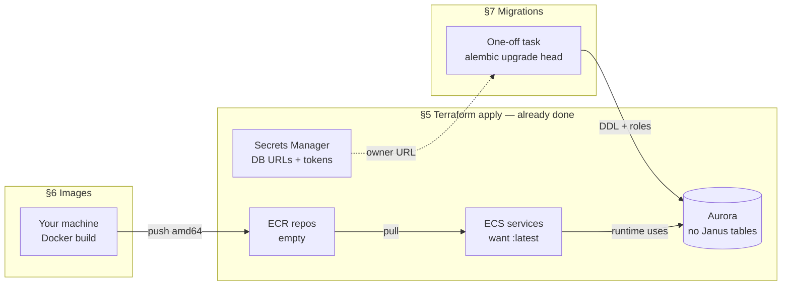
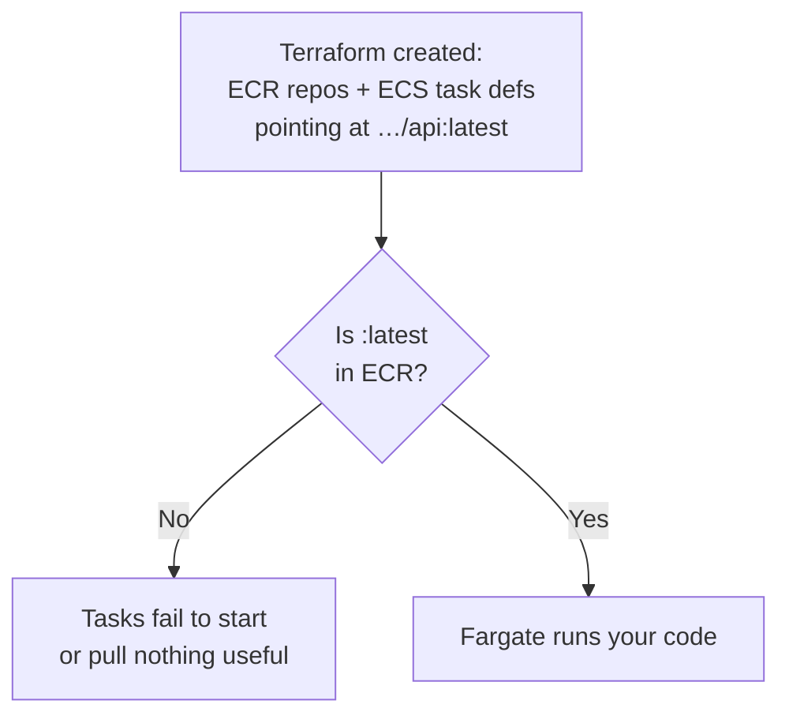
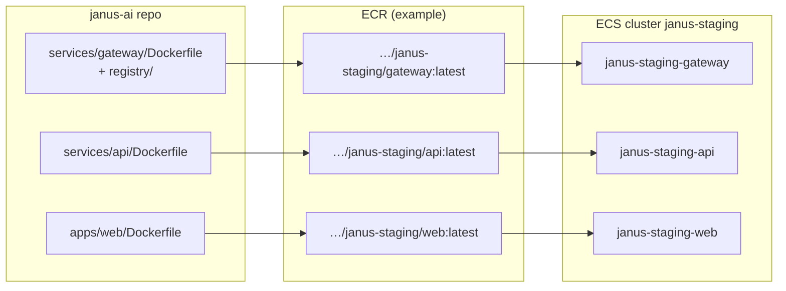
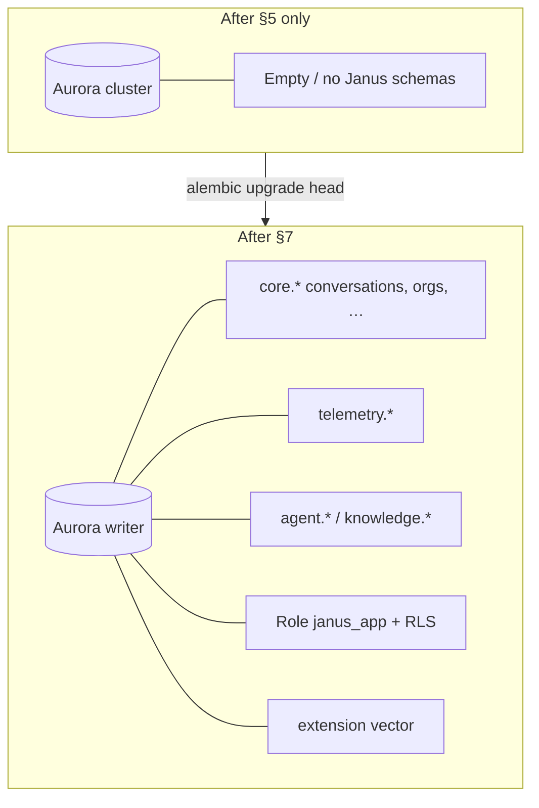
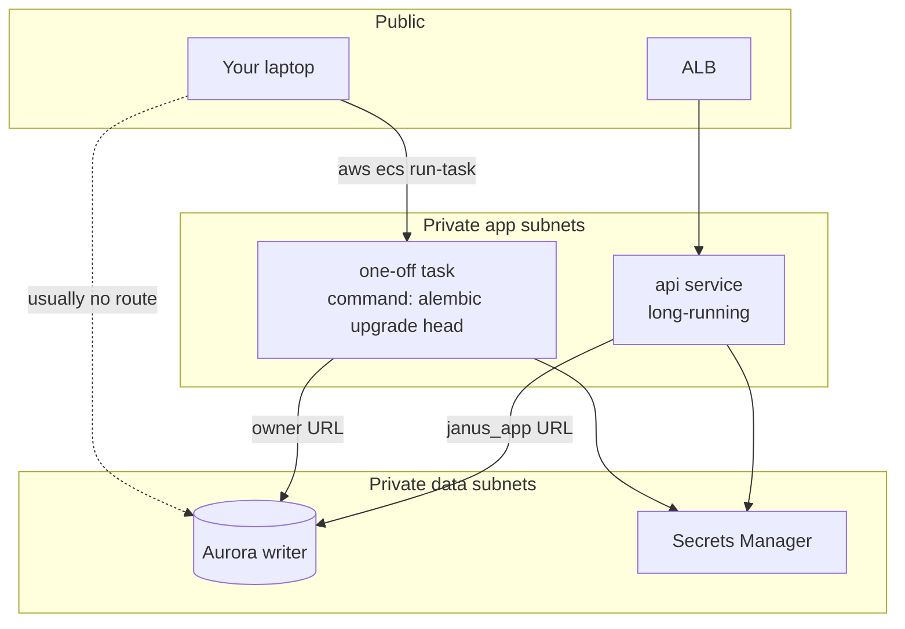
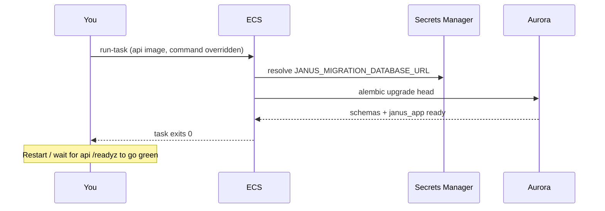
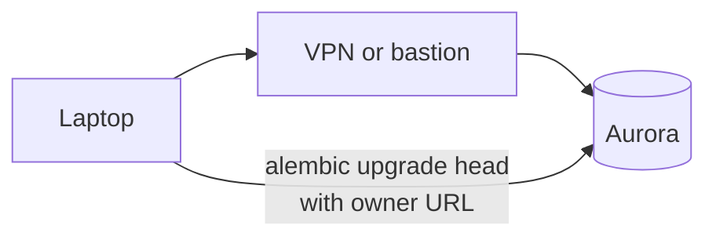
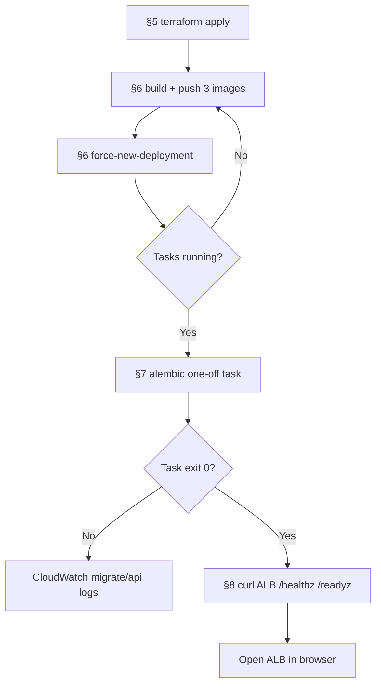

# AWS deploy — images & migrations (visual guide)

**Companion to:** [aws-deploy.md](./aws-deploy.md) §§6–7 · **Last updated:** 2026-08-16

Terraform (§5) builds the **empty parking garage**. Steps **6** and **7** put the
**cars** (container images) in the garage and paint the **floor lines** (database
schema). Without both, the ALB and ECS services exist but the product does not work.

---

## Big picture



| Step | Fills | If you skip it |
|------|--------|----------------|
| **§6** | ECR + running task containers | Tasks crash-loop / stay unhealthy |
| **§7** | Aurora schema + `janus_app` role | API up but sign-in / chat / `/readyz` fail |

Order: **§6 then §7** (migrate is easiest once the `api` image exists in ECR).

---

## §6 — Build and push images

### Why this exists



ECS never builds from your laptop. It only **pulls** from ECR. You must **build → tag → push**, then tell ECS to roll new tasks.

### Flow (what each command does)

```mermaid
sequenceDiagram
  participant You as Your machine (DGX / laptop)
  participant ECR as Amazon ECR
  participant ECS as ECS Fargate

  You->>ECR: docker login (aws ecr get-login-password)
  loop gateway, api, web
    You->>You: docker build --platform linux/amd64
    You->>ECR: docker push …/janus-staging/&lt;svc&gt;:latest
  end
  You->>ECS: update-service --force-new-deployment
  ECS->>ECR: pull :latest
  ECS->>ECS: replace old tasks with new ones
```

### What gets built



### ARM note (DGX Spark)

| Host CPU | Fargate CPU | Build flag |
|----------|-------------|------------|
| ARM64 (Spark) | **amd64** | `PLATFORM=linux/amd64` |
| x86_64 laptop | amd64 | same flag is fine |

If you push an ARM-only image, ECS may pull it and the task will crash immediately.

### After §6 — what “good” looks like

```text
describe-services → running ≈ desired for api, gateway, web
CloudWatch /ecs/janus-staging/api shows the app starting
ALB target groups may still be unhealthy until §7 if /readyz needs schema
```

Commands: [aws-deploy.md §6](./aws-deploy.md#6-build-and-push-images).

---

## §7 — Run database migrations

### Why this exists



Two different database users:

| Who | Secret / URL | Job |
|-----|----------------|-----|
| **Migration** | `JANUS_MIGRATION_DATABASE_URL` (owner) | `CREATE TABLE`, roles, extensions |
| **Running api / gateway** | `JANUS_DATABASE_URL` (`janus_app`) | Normal app traffic under RLS |

If the app tried to migrate itself on every replica start, two tasks could race on DDL. Janus keeps migrate as an explicit one-shot (same idea as the local Compose `migrate` service).

### Preferred path — one-off ECS task

Aurora is in **private** subnets. Your laptop usually cannot open TCP to it. A short Fargate task in the **same VPC / security group as `api`** can.





Console equivalent: **ECS → Task definitions → api → Deploy → Run task**, same subnets/SG as the api service, container command override:

```json
["alembic", "upgrade", "head"]
```

### Alternative — bastion / VPN



Only use this if you already have network path into the data subnets. Load secrets locally; **do not paste them into chat or git**.

### After §7 — what “good” looks like

```text
Migrate task stopped with exit code 0
curl http://$ALB/readyz  → ok / schema checks pass
Browser: register workspace + chat (mock model on staging)
```

Commands: [aws-deploy.md §7](./aws-deploy.md#7-run-database-migrations).

---

## End-to-end checklist (visual)



---

## Related

- Full runbook: [aws-deploy.md](./aws-deploy.md)
- Architecture: [aws.md](./aws.md)
- Ops / logs: [runbooks/troubleshooting.md](./runbooks/troubleshooting.md)
