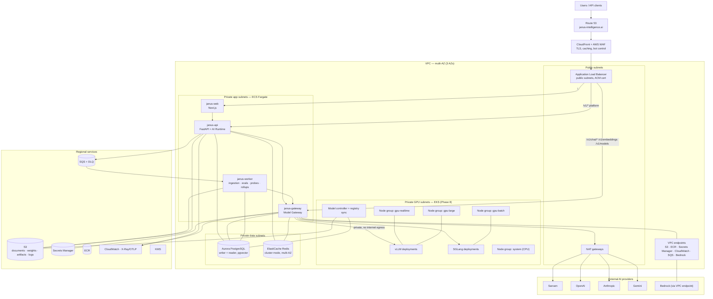

# AWS Architecture

**Status:** Draft for review (Phase 0) · **Last updated:** 2026-08-13

Hybrid by design: **ECS Fargate for the core platform, EKS only for GPU model serving** — and only once Janus actually hosts models.

Related: [architecture.md](./architecture.md) · [model-gateway.md](./model-gateway.md) · [security.md](./security.md) · [observability.md](./observability.md)

---

## 1. Target architecture



---

## 2. Core platform on ECS Fargate

| Service | Sizing (initial) | Scaling signal | Notes |
|---------|------------------|----------------|-------|
| `janus-web` | 0.5 vCPU / 1 GB, 2 tasks | CPU + request count | Stateless SSR; no provider secrets |
| `janus-api` | 1 vCPU / 2 GB, 2–10 tasks | CPU + ALB request count | Hosts the AI Runtime in Phase 1–5 |
| `janus-gateway` | 1 vCPU / 2 GB, 2–20 tasks | Concurrent streams + CPU | Long-lived SSE connections drive concurrency, not CPU |
| `janus-worker` | 1 vCPU / 4 GB, 1–10 tasks | SQS queue depth | Ingestion, embeddings, health probes, rollups, evals |

Fargate specifics that matter here: **ALB idle timeout raised** (streams outlive the 60 s default), **deregistration delay** long enough to drain in-flight generations, `stopTimeout` generous enough for graceful shutdown, and rolling deploys with circuit breaker plus automatic rollback. Blue/green via CodeDeploy is added when traffic justifies it.

Autoscaling for the gateway keys on **active stream count** published as a custom metric — CPU alone understates load for an I/O-bound streaming proxy.

---

## 3. Data layer

| Service | Configuration |
|---------|---------------|
| **Aurora PostgreSQL 16** | Writer + 1 reader minimum, multi-AZ, `pgvector`, encrypted with KMS, automated backups + PITR, Performance Insights, IAM auth or rotated Secrets Manager credentials |
| **ElastiCache Redis** | Cluster mode, multi-AZ, encryption in transit and at rest; rate limits, health cache, registry snapshot, idempotency keys, session cache |
| **S3** | Buckets: documents (per-org prefixes), model weights, artifacts, logs. Versioning, lifecycle to Glacier, block public access, KMS, TLS-only bucket policies |
| **SQS** | Standard queues with DLQs: ingestion, embedding, eval, rollup, health-probe fan-out |

Aurora Serverless v2 is a candidate for dev/staging to cut idle cost; production starts provisioned for predictable latency. Reader endpoints serve analytics and usage dashboards so reporting never affects chat.

---

## 4. GPU serving on EKS (Phase 8)

Introduced **only** when Janus hosts its own models. Until then, the model plane is provider APIs plus local Ollama in development, and no EKS cluster exists.

| Element | Design |
|---------|--------|
| Cluster | Private API endpoint, EKS-managed control plane, IRSA for workload identity |
| System node group | CPU nodes for controllers, autoscaler, metrics, ingress-free internal services |
| GPU node groups | Separate pools with taints and labels; Cluster Autoscaler or Karpenter; capacity reservations for critical pools |
| Runtimes | vLLM (primary) and SGLang (throughput/structured), both exposing OpenAI-compatible endpoints |
| Model controller | Reconciles `registry.model_deployments` to Kubernetes resources; a `JanusModelDeployment` CRD describes model, runtime, hardware, replicas, scale-to-zero, and warm floor |
| Weights | S3 as source of truth with hash pinning; node-local cache and a shared cache volume to cut cold starts |
| Networking | Internal service discovery only; no public ingress; network policies restrict callers to the gateway's security group |
| Health | Readiness probe plus a synthetic inference check before a pod is marked ready ([model-gateway.md](./model-gateway.md#62-deployment-lifecycle-and-warming)) |
| Observability | DCGM exporter for GPU/VRAM metrics, runtime metrics scraped into the platform metrics store |

### 4.1 GPU pools

| Pool | Purpose | Characteristics |
|------|---------|-----------------|
| `gpu-realtime` | Interactive chat | Low latency, warm floor ≥ 1, no scale-to-zero |
| `gpu-large` | Large models (70B–105B class) | Multi-GPU nodes, tensor parallelism, longer cold starts |
| `gpu-batch` | Ingestion, embeddings, evals | Spot-friendly, scale-to-zero, interruption-tolerant |
| `gpu-vision` (future) | Multimodal | Separate because memory profiles differ |
| `gpu-embeddings` (future) | High-QPS embeddings | Many small replicas |

Hardware is **not** hard-coded anywhere: node pools declare instance families (H100/H200/A100/L40S classes, or Trainium/Inferentia where a model supports it) and deployments request a pool by capability, not by instance type. Availability and price drive pool composition over time.

Cost controls: scale-to-zero for non-interactive pools, Spot for batch, warm-pool floors only where users would feel a cold start, and per-deployment cost dashboards ([observability.md](./observability.md#6-usage-metering)).

---

## 5. Networking

| Element | Design |
|---------|--------|
| VPC | Three AZs; public, private-app, private-data, private-GPU subnet tiers |
| Ingress | CloudFront → ALB only. No service is directly internet-reachable |
| Egress | NAT gateways for provider APIs; VPC endpoints for AWS services to avoid NAT cost and keep traffic private |
| Provider egress restriction | Gateway tasks reach only registered provider domains (egress filtering / proxy allow-list) |
| GPU isolation | Inference pods have **no** internet egress; weights arrive via the S3 VPC endpoint |
| Security groups | ALB → web/api/gateway; api/gateway/worker → Aurora and Redis; gateway → EKS inference; nothing else |
| Streaming | CloudFront and ALB configured for SSE passthrough (no buffering, raised idle timeouts) |

---

## 6. Environments and accounts

| Account | Purpose |
|---------|---------|
| `janus-prod` | Production |
| `janus-staging` | Full Terraform parity, smaller sizing, one small GPU deployment in Phase 8 |
| `janus-dev` | Shared integration, provider dev keys, mock backend |
| `janus-shared` | ECR, CI/CD roles, centralized logs |

Separate accounts give hard blast-radius boundaries and make least-privilege IAM tractable.

**Regions:** `us-east-1` is primary for the US launch market, with `us-west-2` as the secondary for availability and for customers who ask for a west-coast footprint. Region is configuration throughout — the registry, policies, and deployment records all carry region — so opening another geography later is a deployment exercise, not a redesign.

---

## 7. Why hybrid ECS + EKS

| Concern | ECS Fargate (core) | EKS (GPU) |
|---------|-------------------|-----------|
| Operational overhead | No cluster, no node upgrades, no add-on lifecycle | Real, but justified |
| What we need | Run stateless containers behind an ALB, autoscale, roll safely | Device plugins, GPU scheduling, topology awareness, node autoscaling, model controllers, warm pools |
| Cost of the alternative | EKS everywhere buys nothing for a FastAPI service and adds permanent ops burden | GPU on ECS means fighting scheduling and cold-start management the ecosystem already solves |

Kubernetes is adopted **where it earns its complexity** and nowhere else ([ADR 0003](./adr/0003-hybrid-ecs-eks.md)). The gateway's deployment abstraction means the core platform is unaware of which orchestrator serves a model, so this boundary can move later without application changes.

---

## 8. Terraform layout

```text
infra/terraform/
├── modules/
│   ├── network/            # VPC, subnets, NAT, endpoints, flow logs
│   ├── edge/               # Route53, ACM, CloudFront, WAF
│   ├── alb/                # ALB, listeners, target groups, rules
│   ├── ecs-service/        # Reusable Fargate service (task, autoscaling, logs, role)
│   ├── aurora/             # Cluster, parameter groups, pgvector, backups
│   ├── redis/              # ElastiCache
│   ├── s3-bucket/          # Hardened bucket baseline
│   ├── sqs-queue/          # Queue + DLQ + alarms
│   ├── secrets/            # Secret definitions + rotation + IAM
│   ├── observability/      # Log groups, OTLP collector, dashboards, alarms
│   ├── eks/                # Cluster, IRSA, add-ons            (Phase 8)
│   └── eks-gpu-nodegroup/  # GPU pools, taints, autoscaling     (Phase 8)
├── environments/
│   ├── dev/                # backend.tf, main.tf, terraform.tfvars
│   ├── staging/
│   └── prod/
└── bootstrap/              # State bucket, DynamoDB lock table, CI OIDC roles
```

Rules: remote state per environment with locking · no resource names hard-coded in application code (discovered via SSM parameters or injected env) · `plan` on pull request, `apply` gated on approval for staging and production · CI assumes role via OIDC, no long-lived AWS keys · drift detection scheduled.

---

## 9. Deployment pipeline

```text
PR → lint · type-check · unit tests · adapter conformance (mock) · secret scan · SCA
   → terraform plan (no apply)
main → build images (ECR, signed) → migrate (dev) → deploy dev → smoke tests
     → staging: migrate → deploy → integration + load smoke → manual gate
     → prod: expand migrations → rolling deploy with circuit breaker → post-deploy verification
```

Migration safety follows expand/migrate/contract so a rollback never requires a backward schema change ([database.md](./database.md#11-migrations)).

---

## 10. Reliability and cost

| Concern | Approach |
|---------|----------|
| Availability target | 99.9% for chat once Phase 7 lands; multi-AZ everywhere; no single-AZ dependency |
| Provider outage | Health-based routing plus policy-legal fallback; a single provider is never a platform dependency |
| Database failure | Aurora automatic failover; app retries with backoff; readers for reporting |
| Disaster recovery | RPO ≤ 5 min (PITR), RTO ≤ 1 h; cross-region snapshot copies; restore runbook rehearsed |
| Backpressure | Load shedding with `Retry-After` before queues collapse |
| Cost visibility | Tags: `Environment`, `Service`, `Component`, `CostCenter`; per-deployment inference cost dashboards; budget alarms |
| Biggest cost levers | GPU pool sizing and scale-to-zero, NAT versus VPC endpoints, Aurora sizing, log retention |

---

## 11. Open questions

1. **Secondary region timing.** Is `us-west-2` stood up at launch for availability, or deferred until a customer requires it?
2. Does sovereign mode require a dedicated VPC or account per enterprise customer, or is region-pinned shared infrastructure acceptable?
3. Aurora Serverless v2 in production, or provisioned only?
4. Karpenter or Cluster Autoscaler for GPU pools in Phase 8?
5. Do we need cross-region GPU capacity for availability, given GPU scarcity and cost?
6. Is CloudFront required in front of the API for anything beyond WAF and TLS termination, given streaming responses are uncacheable?
