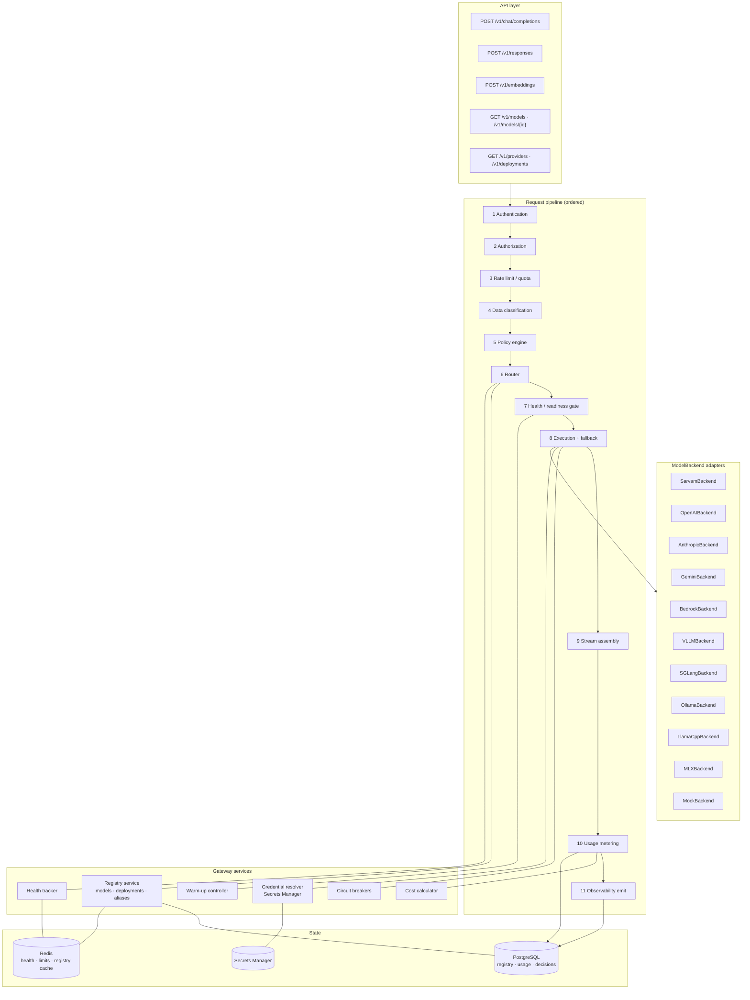
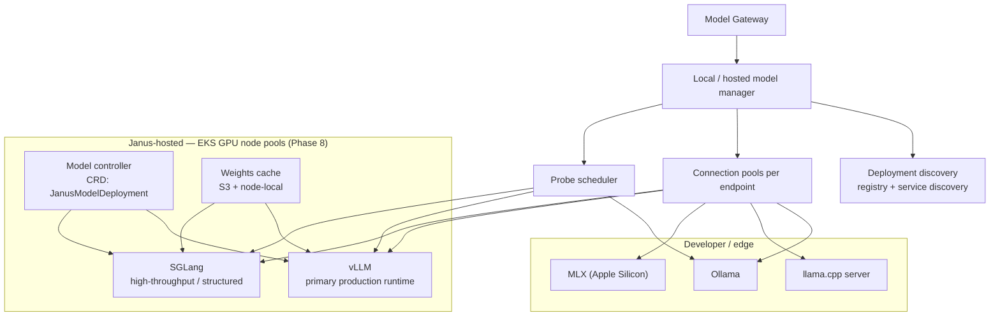
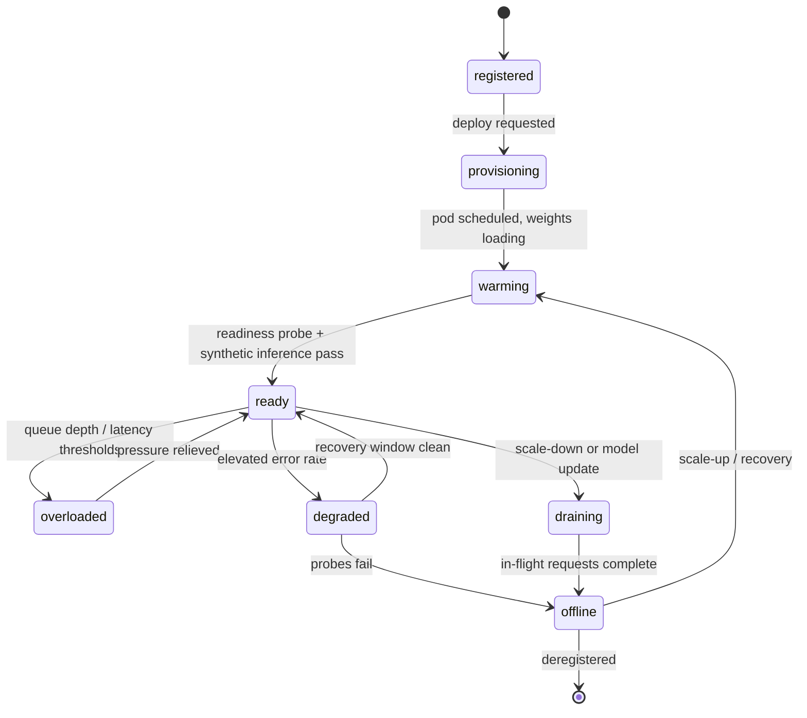

# Model Gateway — Specification

**Status:** Draft for review (Phase 0) · **Component:** `janus-gateway` · **Last updated:** 2026-08-13

The Model Gateway is the only path from Janus code to any AI model. It is simultaneously a **compatibility layer**, a **policy enforcement point**, a **security boundary**, and the **metering point** for all AI usage.

Related: [architecture.md](./architecture.md) · [model-routing.md](./model-routing.md) · [model-registry.md](./model-registry.md) · [security.md](./security.md) · [observability.md](./observability.md)

---

## 1. Responsibilities

| In scope | Out of scope |
|----------|--------------|
| OpenAI-compatible inference API | Prompt engineering, agent logic (→ AI Runtime) |
| Model + deployment resolution | Conversation persistence (→ control plane) |
| Data classification and policy enforcement | Policy *authoring* UI (→ control plane) |
| Routing, fallback, health and readiness gating | Document parsing / chunking (→ workers) |
| Provider credential custody | Billing invoices (→ finance systems, fed by usage records) |
| Usage metering, cost computation | Model training / fine-tuning |
| Backend adapters for every provider and runtime | Vector search (→ runtime + database) |

---

## 2. Internal structure



The pipeline is a list of typed middleware. Stages are individually testable and their order is asserted by a test — reordering classification after routing is a policy bug, not a refactor.

---

## 3. Backend abstraction

Every model runtime implements one interface. This is the mechanism that makes provider independence real rather than aspirational.

```python
class ModelBackend(ABC):
    """One implementation per provider or inference runtime."""

    backend_id: str          # "vllm", "sarvam_api", "bedrock", …
    protocol: Protocol       # OPENAI_COMPATIBLE | NATIVE

    @abstractmethod
    async def generate(
        self, request: ChatRequest, deployment: ModelDeployment, ctx: CallContext
    ) -> ChatResponse: ...

    @abstractmethod
    async def stream(
        self, request: ChatRequest, deployment: ModelDeployment, ctx: CallContext
    ) -> AsyncIterator[ChatChunk]: ...

    @abstractmethod
    async def embeddings(
        self, request: EmbeddingRequest, deployment: ModelDeployment, ctx: CallContext
    ) -> EmbeddingResponse: ...

    @abstractmethod
    async def health(self, deployment: ModelDeployment) -> HealthReport: ...

    @abstractmethod
    async def capabilities(self, deployment: ModelDeployment) -> CapabilitySet: ...
```

`CallContext` carries request id, organization id, classification, deadline, and cancellation token — never raw user identity beyond what a provider needs.

### 3.1 Adapter families

| Family | Adapters | Protocol | Notes |
|--------|----------|----------|-------|
| Cloud API | `SarvamBackend`, `OpenAIBackend`, `AnthropicBackend`, `GeminiBackend`, `BedrockBackend` | Native or OpenAI-compatible per provider | Credentials from Secrets Manager, per-provider rate limits |
| Janus-hosted | `VLLMBackend`, `SGLangBackend` | OpenAI-compatible | Private VPC endpoints, no internet egress |
| Local / edge | `OllamaBackend`, `LlamaCppBackend`, `MLXBackend` | OpenAI-compatible (Ollama, llama.cpp server) or native (MLX) | Dev and sovereign/offline modes |
| Test | `MockBackend` | — | Deterministic, no network; used by CI |

Where a provider already speaks OpenAI protocol, the adapter is thin — a base `OpenAICompatibleBackend` class handles it and specific adapters override auth, endpoint shape, and quirks.

### 3.2 Adapter conformance suite

Provider abstractions leak through feature differences. A shared test suite runs against every adapter (mock-recorded fixtures in CI, live smoke tests nightly):

| Conformance case | Requirement |
|------------------|-------------|
| Non-streaming completion | Correct text, finish reason, usage counts |
| Streaming | Ordered deltas, terminal chunk, usage on completion |
| Cancellation mid-stream | Upstream connection closed, partial usage recorded |
| Tool calling | Normalized to Janus tool-call schema, or capability reported as unsupported |
| Structured output / JSON mode | Honored, or downgraded with an explicit `capability_downgraded` flag |
| Long context near limit | Correct token accounting or a typed `context_length_exceeded` |
| Timeout | Typed error inside budget, no socket leak |
| Auth failure | `provider_auth_failed`, never leaks the key |
| Rate limited | `provider_rate_limited` with retry hint |
| Multilingual (Indic scripts) | Byte-safe round trip, no mojibake |

A provider that cannot satisfy a case must **declare the capability absent** so the router stops offering it. Silent degradation is forbidden.

### 3.3 Capability negotiation

Requests state requirements; adapters state abilities. The gateway reconciles:

```text
required capability present            → proceed
optional capability absent             → proceed, set capability_downgraded, record in decision log
required capability absent             → deployment is ineligible; router excludes it
```

---

## 4. Public interface

OpenAI-compatible wherever practical, so LangChain, LangGraph, the OpenAI SDKs, and customer applications work unmodified.

| Endpoint | Phase | Notes |
|----------|-------|-------|
| `POST /v1/chat/completions` | 3 | Streaming and non-streaming |
| `POST /v1/embeddings` | 3 | Batch input |
| `GET /v1/models` | 3 | Policy-filtered per caller |
| `GET /v1/models/{id}` | 3 | Capabilities, deployments, availability |
| `GET /v1/providers` | 3 | Configured providers and status |
| `GET /v1/deployments` | 4 | Admin-scoped |
| `POST /v1/responses` | 5 | Janus-native superset: routing hints, agent context |
| `POST /v1/audio/transcriptions` · `/v1/audio/speech` | 10 | Voice |
| `POST /v1/images/generations` | 10 | Image |

### 4.1 Janus extensions

Extensions live in a namespaced field so OpenAI clients ignore them safely:

```json
{
  "model": "auto",
  "messages": [{ "role": "user", "content": "…" }],
  "stream": true,
  "janus": {
    "mode": "private",
    "classification": "CONFIDENTIAL",
    "requirements": { "capabilities": ["reasoning", "long_context"], "languages": ["hi"] },
    "constraints": { "max_cost_usd": 0.05, "max_latency_ms": 8000, "regions": ["ap-south-1"] },
    "routing": { "explain": true },
    "agent_id": "agt_…",
    "conversation_id": "cnv_…"
  }
}
```

Responses echo the resolved selection:

```json
{
  "model": "sarvam-105b",
  "janus": {
    "request_id": "rq_…",
    "deployment": "janus-gpu-aps1",
    "privacy": "private",
    "fallback_used": false,
    "routing_explanation": "Selected for long-context reasoning with strong Indic support under a private-only policy.",
    "usage_cost_usd": 0.0123,
    "capability_downgraded": []
  }
}
```

`routing_explanation` is a **generated, safe summary** — never model chain-of-thought, never internal endpoint names. Full contract in [api.md](./api.md).

---

## 5. Model resolution

The `model` field accepts four forms, resolved in order:

| Form | Example | Meaning |
|------|---------|---------|
| `auto` | `auto` | Router selects freely within policy |
| Capability alias | `janus/fast`, `janus/reasoning`, `janus/indic` | Router selects within a curated class |
| Model slug | `sarvam-105b`, `janus/llama-70b` | Specific model; router picks the deployment |
| Deployment-qualified | `sarvam-105b@janus-gpu-aps1` | Specific model **and** deployment; admin/eval use |

Even an explicit slug still passes through policy and health gating: a user cannot name their way past a restriction, and a caller pinning a deployment gets a typed error rather than a silent substitution if it is ineligible.

---

## 6. Local and Janus-hosted serving



### 6.1 Runtime selection guidance

| Runtime | Use for | Avoid for |
|---------|---------|-----------|
| **vLLM** | Primary production serving of open-weight models (Llama, Qwen, Mistral, DeepSeek, self-hosted Sarvam) | Tiny CPU deployments |
| **SGLang** | High-throughput structured generation, heavy prefix reuse | Being the only runtime — keep vLLM as baseline |
| **Ollama** | Local dev, laptops, DGX Spark experimentation, small models | Multi-tenant production traffic |
| **llama.cpp** | CPU-only, edge, heavily quantized, offline mode | Large-batch serving |
| **MLX** | Apple Silicon developer machines | Any server deployment |

Because all of these expose (or can expose) an OpenAI-compatible surface, the gateway treats them uniformly: a deployment record supplies `backend`, `endpoint`, hardware facts, and privacy level. `model = "janus/llama-70b"` may resolve to vLLM while `model = "janus/qwen-local"` resolves to SGLang, with no gateway code change.

### 6.2 Deployment lifecycle and warming



Routing eligibility by state:

| State | Eligible | Notes |
|-------|----------|-------|
| `ready` | yes | Normal target |
| `overloaded` | only if no `ready` alternative | Deprioritized by score |
| `degraded` | last resort, non-critical requests | Circuit breaker may exclude |
| `warming`, `provisioning`, `draining`, `offline` | **no** | Never receive production traffic |

Cold-start handling: scale-to-zero deployments keep a **warm pool** floor for interactive tiers; requests for a cold deployment either wait behind an explicit warming budget (if the caller's deadline allows) or route elsewhere. A request never blocks indefinitely on a cold GPU.

---

## 7. Resilience

| Mechanism | Design |
|-----------|--------|
| Timeouts | Per-deployment connect / TTFT / total budgets. Total budget never exceeds the caller deadline |
| Retries | Idempotent operations only; jittered exponential backoff; **no** retry after tokens have streamed |
| Circuit breakers | Per deployment; open on error-rate or timeout thresholds; half-open probes |
| Bulkheads | Bounded concurrency per deployment so one slow provider cannot exhaust workers |
| Load shedding | Reject early with `Retry-After` when queue depth exceeds capacity |
| Fallback | Policy-constrained chain ([model-routing.md](./model-routing.md#7-fallback)) |
| Graceful degradation | Optional capabilities may be downgraded, flagged, and logged — privacy and region constraints never |

---

## 8. Metering

Usage is recorded for every call, including failures and cancellations.

| Field | Purpose |
|-------|---------|
| `request_id`, `organization_id`, `user_id`, `api_key_id` | Attribution |
| `model_id`, `deployment_id`, `provider`, `backend` | What served it |
| `input_tokens`, `output_tokens`, `cached_tokens` | Volume |
| `ttft_ms`, `total_ms`, `tokens_per_second` | Performance |
| `cost_usd`, `cost_basis` | Cost, plus how it was derived (provider price list vs. amortized GPU rate) |
| `fallback_used`, `capability_downgraded`, `error_code` | Quality of service |

Cost for Janus-hosted models is an **amortized GPU-hour rate**, explicitly labeled as such. Provider costs come from a versioned price table, never hard-coded. Details in [observability.md](./observability.md#6-usage-metering).

---

## 9. Local development and testing

Requirements:

1. The gateway runs on a laptop or DGX Spark with **no AWS dependency** — Postgres and Redis in Docker Compose, registry seeded from YAML.
2. `MockBackend` returns deterministic responses and simulates streaming, latency, tool calls, rate limits, and failures. CI never calls a paid provider.
3. Ollama is the default real local backend; a developer can chat end-to-end offline.
4. Recorded provider fixtures (secrets scrubbed) drive adapter conformance tests.

```text
docker compose up            # postgres, redis, gateway, api, web
JANUS_MODE=offline           # local models only
JANUS_REGISTRY_SEED=./seeds/local.yaml
```

---

## 10. Security boundary

The gateway is where tenant data meets third parties. Non-negotiable:

- Provider credentials are read only by `janus-gateway` from Secrets Manager, cached in memory, never logged, never returned by any endpoint.
- One tenant's credentials, data, or files can never reach another tenant's request. Bring-your-own-key material is scoped per organization.
- Outbound requests carry only what the provider needs. No internal hostnames, no Janus infrastructure detail, no other tenants' identifiers.
- Janus-hosted endpoints are reachable only from private subnets with no internet egress.
- Model chain-of-thought and internal routing traces are never returned to clients.

Full model in [security.md](./security.md).

---

## 11. Performance budget

| Metric | Target | Rationale |
|--------|--------|-----------|
| Gateway overhead added to TTFT | **< 25 ms p95** | Users must not pay for the abstraction |
| Registry / policy lookup | < 5 ms p95 | Redis-cached, in-process TTL cache |
| Routing decision | < 10 ms p95 | Scoring is arithmetic over a small candidate set |
| Streaming relay overhead | < 3 ms per chunk p95 | Backpressure-aware passthrough |
| Availability | 99.9% Phase 7+ | Multi-AZ, stateless, provider-independent failure domains |

Measured per release; regression beyond budget blocks the release.

---

## 12. Open questions

1. Do we expose `/v1/responses` (Janus-native) in Phase 3 alongside chat completions, or defer to Phase 5 as planned?
2. Bring-your-own-key per organization — Phase 9 enterprise feature, or earlier for design partners?
3. Should embeddings share the same router and policy path as chat (recommended) or use a simplified path for latency?
4. Amortized GPU cost basis: per-deployment fixed rate, or computed from actual node utilization?
5. Do we support provider-side prompt caching semantics in Phase 3, given accounting differences across providers?
