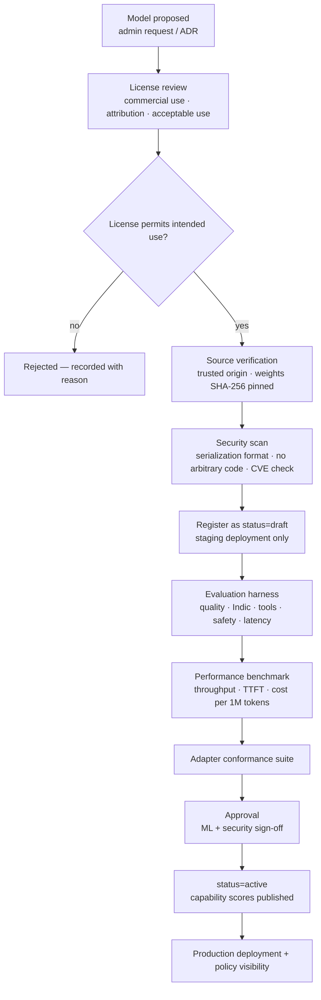

# Model Registry — Schema and Governance

**Status:** Draft for review (Phase 0) · **Last updated:** 2026-08-13

The registry is the single source of truth for **what models exist, what they can do, where they run, and whether they are allowed to run at all**. The router reads it; administrators curate it; nothing reaches production without a record here.

Related: [model-gateway.md](./model-gateway.md) · [model-routing.md](./model-routing.md) · [database.md](./database.md) · [security.md](./security.md)

---

## 1. Entities

| Entity | Grain | Purpose |
|--------|-------|---------|
| `Provider` | Vendor or hosting authority | Sarvam, OpenAI, Anthropic, Google, AWS Bedrock, Janus, Meta, Alibaba, DeepSeek |
| `Model` | Logical model (weights + family + version) | Capabilities, languages, license, context window |
| `ModelDeployment` | Physical servable endpoint | Backend, endpoint, region, hardware, privacy, health |
| `ModelAlias` | Stable name → model or class | `janus/fast`, `janus/reasoning`, legacy names |
| `ModelCapabilityScore` | Measured quality per capability | Populated **only** by the evaluation harness |
| `ModelPriceVersion` | Versioned pricing | Cost calculation without hard-coded rates |

A model is **not** servable until it has at least one deployment in `ready` state and an approved license record.

The registry is **platform-scoped**, not per-tenant. Organizations get *visibility and permission* through policy, not private copies — one fleet, many policies ([ADR 0007](./adr/0007-platform-scoped-registry.md)).

---

## 2. Model record

```json
{
  "id": "mdl_01JBX…",
  "slug": "sarvam-105b",
  "display_name": "Sarvam 105B",
  "family": "sarvam",
  "version": "1.0",
  "provider": "sarvam",
  "type": "chat",
  "parameters": "105B",
  "architecture": "transformer-moe",
  "context_window": 128000,
  "max_output_tokens": 8192,
  "input_modalities": ["text"],
  "output_modalities": ["text"],
  "languages": ["en", "hi", "te", "ta", "kn", "ml", "mr", "bn", "gu", "pa", "or"],
  "capabilities": {
    "reasoning": true,
    "agentic": true,
    "tool_calling": true,
    "structured_output": true,
    "long_context": true,
    "indic": true,
    "multilingual": true,
    "streaming": true,
    "coding": true,
    "vision": false,
    "embeddings": false
  },
  "cost_class": "high",
  "latency_class": "medium",
  "tier": "recommended",
  "status": "active",
  "license_id": "lic_…",
  "notes": "Verify parameter count, context window, and language list against provider documentation before Phase 2.",
  "created_at": "2026-08-13T00:00:00Z"
}
```

Janus-hosted open model:

```json
{
  "id": "mdl_01JBY…",
  "slug": "janus/llama-70b",
  "display_name": "Llama 70B (Janus Hosted)",
  "family": "llama",
  "provider": "meta",
  "type": "chat",
  "parameters": "70B",
  "context_window": 131072,
  "capabilities": {
    "reasoning": true, "coding": true, "tool_calling": true,
    "long_context": true, "streaming": true, "indic": false
  },
  "cost_class": "fixed",
  "latency_class": "low",
  "tier": "open_source",
  "status": "active",
  "license_id": "lic_llama_community",
  "weights_source": "s3://janus-model-weights/llama-70b/…",
  "weights_sha256": "…",
  "quantization": "fp8"
}
```

### 2.1 Field semantics

| Field | Rules |
|-------|-------|
| `slug` | User-visible identifier; immutable once published. `janus/` prefix reserved for Janus-hosted |
| `type` | `chat` · `embedding` · `rerank` · `transcription` · `speech` · `image` |
| `capabilities` | Declared; verified by conformance + evals. Failed verification auto-disables the flag and alerts |
| `cost_class` | `free` · `low` · `medium` · `high` · `fixed` (fixed = amortized Janus GPU) |
| `latency_class` | `low` · `medium` · `high` — coarse prior; observed percentiles override in scoring |
| `tier` | `recommended` · `frontier` · `open_source` · `experimental` · `deprecated` — drives catalog grouping |
| `status` | `draft` · `evaluating` · `active` · `deprecated` · `disabled` |
| `languages` | ISO 639-1; presence ≠ quality. Quality lives in `ModelCapabilityScore` |

Unverified values carry a `notes` field and appear in the admin UI as unverified. Nothing fabricated is presented to users as fact.

---

## 3. Identifier grammar

```text
model_slug        := [ "janus/" ] name
deployment_ref    := model_slug "@" deployment_key
alias             := "janus/" class_name          ; janus/fast, janus/reasoning, janus/indic
```

| Example | Resolves to |
|---------|-------------|
| `sarvam-105b` | Model; router picks the deployment |
| `sarvam-105b@sarvam-cloud-in` | Sarvam's own API in India |
| `sarvam-105b@janus-gpu-aps1` | Self-hosted on Janus GPU, ap-south-1 |
| `janus/llama-70b` | Janus-hosted Llama |
| `janus/fast` | Alias → curated fast class |
| `auto` | Router selects freely within policy |

The same weights served in two places are **one model, two deployments** — the user-visible distinction ("Sarvam 105B Cloud" vs. "Sarvam 105B Janus GPU") is rendered from deployment metadata, while application code stays provider-agnostic.

---

## 4. Deployment record

```json
{
  "id": "dep_01JBZ…",
  "key": "janus-gpu-aps1",
  "model_id": "mdl_01JBX…",
  "backend": "vllm",
  "protocol": "openai_compatible",
  "endpoint": "http://sarvam-105b.inference.svc.cluster.local:8000/v1",
  "region": "ap-south-1",
  "deployment_type": "janus_gpu",
  "privacy_level": "private",
  "data_residency": ["IN"],
  "hardware": { "gpu_type": "H100", "gpu_count": 8, "node_pool": "gpu-large" },
  "replicas": { "min": 1, "max": 4, "current": 2 },
  "max_context": 128000,
  "max_concurrency": 64,
  "scale_to_zero": false,
  "warm_pool_floor": 1,
  "status": "ready",
  "health": {
    "state": "ready",
    "ttft_p95_ms": 640,
    "tokens_per_second": 58.2,
    "queue_depth": 3,
    "error_rate": 0.001,
    "gpu_utilization": 0.71,
    "vram_utilization": 0.83,
    "last_probe_at": "2026-08-13T12:00:00Z"
  },
  "capability_overrides": { "structured_output": false },
  "cost_basis": { "type": "amortized_gpu_hour", "usd_per_hour": 0.0, "note": "set from actual node cost" },
  "created_at": "2026-08-13T00:00:00Z"
}
```

| Field | Notes |
|-------|-------|
| `deployment_type` | `provider_cloud` · `janus_gpu` · `janus_cpu` · `local_dev` · `customer_vpc` (future) |
| `privacy_level` | `provider` (data leaves Janus) · `private` (Janus infrastructure) · `local` (operator's own machine) |
| `endpoint` | Internal only. **Never** returned by public API responses |
| `capability_overrides` | Deployment reality wins over model declaration |
| `cost_basis` | How cost is computed; `amortized_gpu_hour` figures are labeled as estimates |

`endpoint` is stored as a reference to configuration/secret material rather than a public column value; admin APIs return it only to platform operators ([security.md](./security.md#5-authorization-model)).

---

## 5. Alias and class definitions

```json
{
  "alias": "janus/reasoning",
  "description": "Best available reasoning model within policy",
  "selection": { "require": ["reasoning"], "weight_profile": "quality_first" },
  "members": ["sarvam-105b", "janus/llama-70b"],
  "membership": "dynamic"
}
```

`dynamic` membership means the router evaluates any model satisfying the predicate, so a newly onboarded model becomes available without editing the alias. `static` membership pins an explicit list where predictability matters (for example a customer-facing SLA).

---

## 6. Onboarding pipeline

No arbitrary weights are ever downloaded and executed on production infrastructure.



Tracked for every model: license, source, weights hash, version, quantization, architecture, context window, known vulnerabilities, evaluation results, approver, and approval timestamp.

Safetensors is required for self-hosted weights; pickle-based formats are rejected.

---

## 7. License compliance

```json
{
  "id": "lic_llama_community",
  "name": "Llama Community License",
  "spdx_id": null,
  "url": "https://…",
  "commercial_use": "permitted_with_conditions",
  "attribution_required": true,
  "attribution_text": "Built with Llama",
  "redistribution_of_weights": "restricted",
  "acceptable_use_restrictions": ["…"],
  "reviewed_by": "usr_…",
  "reviewed_at": "2026-08-13T00:00:00Z",
  "review_notes": "…"
}
```

Rules:

- A model cannot reach `active` without a reviewed license record.
- Required attributions render in the model catalog and in API model metadata.
- Acceptable-use restrictions that must be enforced at runtime become policy rules, not documentation footnotes.
- Weight redistribution restrictions govern how Janus stores and moves weights across regions and accounts.

---

## 8. Configuration as code

Registry content is declarative and reviewed in Git, then applied to the database by a migration/sync job — so a model change is a pull request, not a console click.

```yaml
# registry/models/sarvam-105b.yaml
slug: sarvam-105b
display_name: Sarvam 105B
provider: sarvam
type: chat
tier: recommended
context_window: 128000          # VERIFY against provider docs
languages: [en, hi, te, ta, kn, ml, mr, bn, gu, pa, or]
capabilities: [reasoning, agentic, tool_calling, structured_output, long_context, indic, streaming]
license: lic_sarvam_open
deployments:
  - key: sarvam-cloud-in
    backend: sarvam_api
    deployment_type: provider_cloud
    privacy_level: provider
    region: ap-south-1
    credentials_ref: secretsmanager://janus/prod/providers/sarvam
  - key: janus-gpu-aps1
    backend: vllm
    deployment_type: janus_gpu
    privacy_level: private
    region: ap-south-1
    hardware: { gpu_type: H100, gpu_count: 8, node_pool: gpu-large }
    enabled_from_phase: 8
```

Environment overlays (`registry/environments/{local,dev,staging,prod}.yaml`) decide which deployments exist where. Local seeds reference Ollama and the mock backend only.

---

## 9. Presentation

The catalog UI and model detail pages render **only** registry data: model, provider, deployment, context, capabilities, languages, latency, availability, privacy, and cost class.

Guardrails:

- Janus-hosted models may state *"Hosted by Janus — your data stays within Janus infrastructure"* **only** when the deployment's `privacy_level` is `private` and the infrastructure actually guarantees it (private subnets, no internet egress, verified in the security review).
- Benchmark figures appear only when sourced from `ModelCapabilityScore` rows produced by the Janus harness, labeled with the eval run and date. No third-party or marketing numbers.
- Unverified metadata is visibly marked in admin views and omitted from user-facing copy.
- Deployment endpoints, hardware detail, and internal keys are operator-only.

---

## 10. Open questions

1. Who owns model approval — a standing review group, or ML plus security sign-off per model?
2. Do organizations get an opt-in path to models still in `evaluating` status (design-partner early access)?
3. Should deprecation force migration for pinned callers after a notice window, or hard-fail on the deprecation date?
4. How are model versions handled — new slug per version, or version field with pinning support?
5. Do we mirror all self-hosted weights into a Janus-controlled S3 bucket for reproducibility, given per-license redistribution limits?
