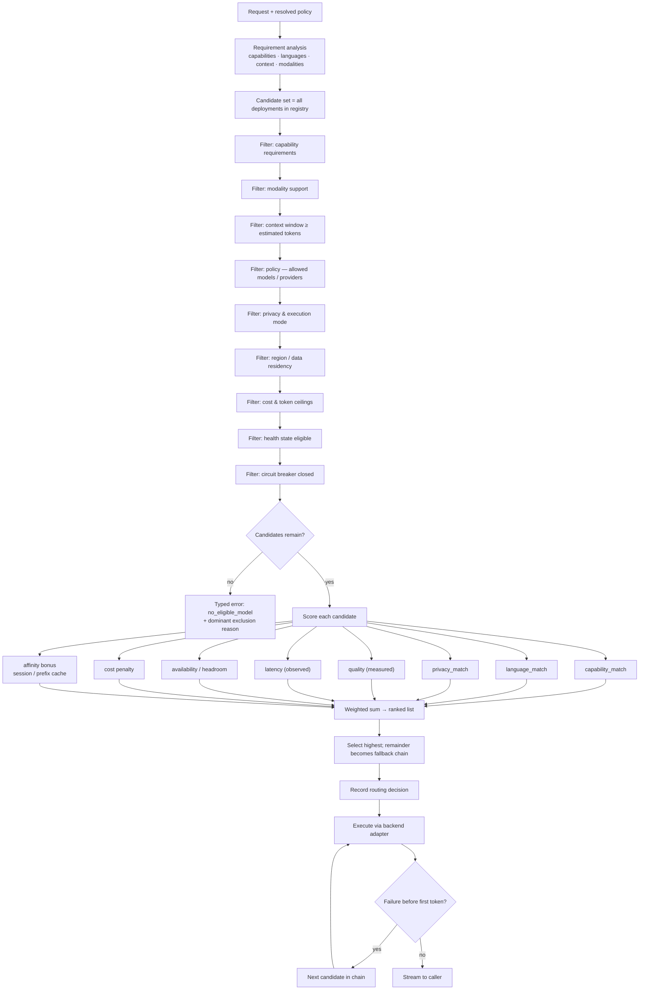
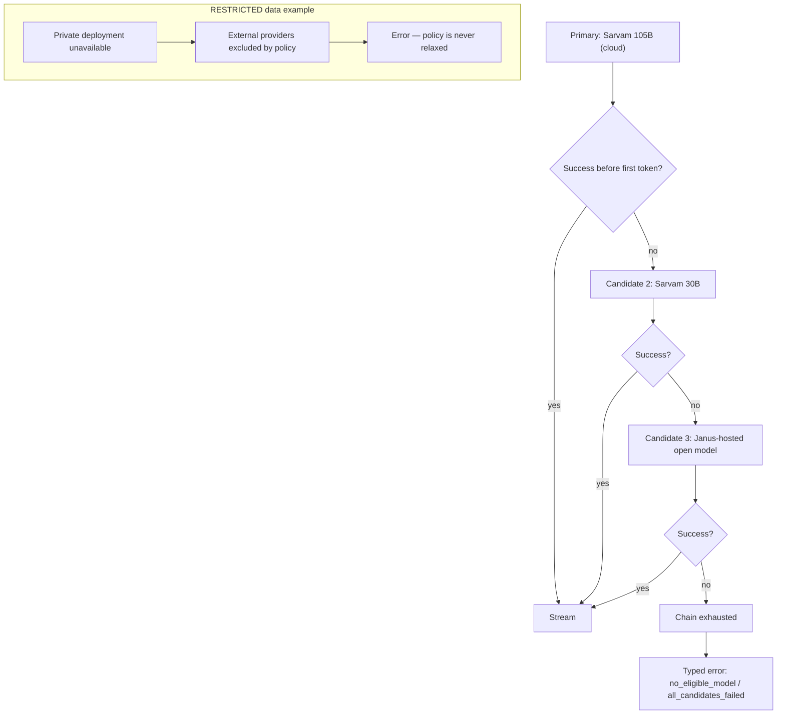

# Model Routing — Specification

**Status:** Draft for review (Phase 0) · **Component:** `janus-gateway` / `ModelRouter` · **Last updated:** 2026-08-13

The router answers one question: **given this request, this policy, and the current state of the model fleet, which deployment should serve it — and why?**

Related: [model-gateway.md](./model-gateway.md) · [model-registry.md](./model-registry.md) · [security.md](./security.md) · [observability.md](./observability.md)

---

## 1. Principles

1. **Constraints are hard, preferences are soft.** Privacy, region, and allow-lists eliminate candidates. Quality, latency, and cost only reorder survivors.
2. **Never widen a constraint to succeed.** An exhausted fallback chain returns a typed error.
3. **Policy is data, not code.** Weights, tiers, and rules are configuration, versioned and auditable.
4. **Every decision is explainable.** Candidate set, exclusion reasons, and score components are recorded.
5. **The router is not the model.** Phase 3–7 routing is deterministic scoring over metadata. Learned or LLM-based routing is opt-in and only after the evaluation harness can prove it helps.

---

## 2. Routing modes

| Mode | Caller says | Router freedom |
|------|-------------|----------------|
| Explicit deployment | `sarvam-105b@janus-gpu-aps1` | None — validate policy and health, else error |
| Explicit model | `sarvam-105b` | Choose among that model's deployments |
| Capability alias | `janus/reasoning`, `janus/fast`, `janus/indic`, `janus/coding` | Choose within a curated class |
| Auto | `auto` | Full freedom within policy |

Auto is the intended default consumer experience: the user should not need to know the model ecosystem exists.

---

## 3. Decision flow



Filters run cheapest-first and short-circuit. The typical candidate set is tens of deployments, so scoring is trivial arithmetic — the < 10 ms p95 budget is comfortable.

---

## 4. Requirement analysis

Requirements come from three sources, merged with explicit input winning:

| Source | Example |
|--------|---------|
| Explicit request (`janus.requirements`) | `capabilities: [reasoning, long_context]`, `languages: [hi]` |
| Agent model policy | `min_capability: reasoning`, `privacy: private` |
| Inferred from the request | Attached image → `vision`; Devanagari text → `indic`; large context → `long_context`; code fences → `coding` |

Inference in Phase 3 is deliberately **cheap and deterministic**: script detection, attachment types, token estimates, and simple structural signals. No classifier model in the hot path. A small classifier is a Phase 10 experiment, gated on measured benefit.

Worked example from the brief:

```text
"Analyze this Hindi legal document and summarize it."   (document attached, org policy: confidential)

Requirements  → languages=[hi], capabilities=[indic, long_context, reasoning, documents]
Constraints   → classification=CONFIDENTIAL → privacy=private → external providers excluded
Result        → highest-scoring private deployment with Indic + long context
Explanation   → "Selected for long-context reasoning with strong Indic support under a private-only policy."
```

---

## 5. Capability system

Capabilities are declared per model (and refined per deployment where the runtime changes behavior).

| Group | Capabilities |
|-------|--------------|
| Reasoning | `reasoning`, `high_quality`, `agentic` |
| Language | `multilingual`, `indic`, `translation` |
| Coding | `coding`, `structured_output` |
| Tools | `tool_calling`, `parallel_tool_calls` |
| Modality | `vision`, `audio_in`, `audio_out`, `documents` |
| Context | `long_context` |
| Serving | `streaming`, `fast_response`, `embeddings` |
| Deployment | `privacy`, `on_premise`, `offline`, `low_cost` |

Rules:

- Capabilities are **declared** in the registry and **verified** by the adapter conformance suite plus evaluation runs. A declared capability that fails verification is disabled automatically and raises an alert.
- Deployment-level overrides exist because the same weights behave differently across runtimes (for example a quantized llama.cpp build losing reliable structured output).
- Quality scores per capability come only from the Janus evaluation harness. Unmeasured models get a neutral prior and are eligible but not preferred.

---

## 6. Scoring

```text
score(deployment) =
      w_cap  · capability_match      # 0..1 fraction of desired (incl. optional) capabilities
    + w_lang · language_match        # measured quality for requested language
    + w_priv · privacy_match         # exceeds requirement > exactly meets
    + w_qual · quality               # measured, per capability class
    + w_lat  · latency_score         # from observed TTFT/throughput percentiles
    + w_avail· availability_score    # health state + queue headroom
    + w_aff  · affinity              # session stickiness, prefix cache locality
    - w_cost · cost_estimate         # normalized per-request estimate
```

All weights and normalizations are configuration. Nothing above is hard-coded permanently.

### 6.1 Weight profiles

Named profiles keep intent legible; policies select a profile and may override individual weights.

| Profile | Emphasis | Used by |
|---------|----------|---------|
| `balanced` | Default blend | Consumer chat, Auto mode |
| `quality_first` | Quality and capability dominate | Complex reasoning, agent planning steps |
| `speed_first` | Latency dominates | Interactive short turns, autocomplete-style calls |
| `cost_optimized` | Strong cost penalty | Bulk processing, batch jobs, free tiers |
| `privacy_first` | Private/sovereign strongly preferred | Regulated organizations |

Cost/latency tiering example (the brief's intent, expressed as policy rather than code): short simple turns land on a fast mid-size model, complex reasoning escalates to a frontier or 105B-class model, specialized coding requests prefer a coding-capable model, and confidential requests are constrained to Janus-private deployments.

### 6.2 RoutingPolicy scopes

A policy may be defined at five scopes, resolved most-specific-wins for preferences and **most-restrictive-wins** for constraints:

```text
platform default  →  organization  →  team  →  agent  →  request
```

```json
{
  "id": "pol_…",
  "scope": "organization",
  "scope_id": "org_…",
  "mode": "private",
  "weight_profile": "privacy_first",
  "weights": { "cost": 0.8 },
  "allow": { "providers": ["sarvam", "janus"], "regions": ["ap-south-1"] },
  "deny": { "providers": ["openai", "anthropic", "google"] },
  "limits": { "max_cost_usd_per_request": 0.05, "max_output_tokens": 4096 },
  "classification_rules": {
    "RESTRICTED": { "mode": "sovereign" },
    "CONFIDENTIAL": { "mode": "private" }
  },
  "fallback": { "enabled": true, "max_attempts": 3, "allow_cross_provider": true }
}
```

A request may narrow (`mode: private` under an `auto` org) but never widen. Resolution algebra and precedence table live in [security.md](./security.md#8-policy-resolution).

---

## 7. Fallback

The ranked remainder of the candidate list **is** the fallback chain — already filtered, so every fallback is policy-legal by construction.



Rules:

| Rule | Rationale |
|------|-----------|
| Fallback only **before the first token** is emitted | Mid-stream provider switching produces incoherent output |
| Never violate privacy, region, or allow-list constraints | Correctness and compliance |
| Bounded attempts (default 3) within the caller's deadline | Predictable latency |
| Every attempt recorded with its failure reason | Explainability, provider SLA tracking |
| Cross-provider fallback is policy-gated | Some organizations require single-provider processing |
| Response flags `fallback_used`; degraded quality is surfaced, not hidden | Operational honesty |

Post-first-token failures surface as a stream error with partial content preserved and usage recorded.

---

## 8. Health input

The router consumes, per deployment:

| Signal | Effect |
|--------|--------|
| State (`ready` / `overloaded` / `degraded` / `warming` / `offline`) | Eligibility filter |
| TTFT and total latency percentiles | `latency_score` |
| Tokens/sec throughput | `latency_score` for long generations |
| Queue depth, concurrency headroom | `availability_score` |
| Error rate (sliding window) | `availability_score`, breaker state |
| GPU / VRAM utilization (Janus-hosted) | Overload detection, capacity planning |

Health lives in Redis with short TTLs, written by probe workers and by real request outcomes. Sticky-but-decaying: a deployment that just failed is deprioritized before the breaker formally opens.

---

## 9. Explainability

For every request the router records a `routing_decisions` row (see [observability.md](./observability.md#4-routing-decision-log)): candidate set with exclusion reasons, score components for survivors, selected deployment, fallback attempts, policy version, and weight profile.

Two audiences, two views:

| Audience | Exposure |
|----------|----------|
| End user / API caller | One safe sentence: *"Selected Sarvam 105B because this request requires long-context reasoning and strong Indic language support."* |
| Org admin / Janus operator | Full decision record: candidates, exclusions, scores, policy version |

Never exposed: model chain-of-thought, internal endpoint hostnames, other tenants' data, raw weight values in end-user copy.

---

## 10. Testing

| Test class | Method |
|-----------|--------|
| Constraint correctness | Property-based: no selected deployment ever violates a hard constraint, across randomized policies and fleets |
| Determinism | Identical request + fleet state + policy version → identical decision |
| Fallback safety | Fault injection at each stage; assert no policy relaxation and no post-token switching |
| Explainability completeness | Every decision has a candidate set, a reason per exclusion, and score components |
| Regression | Golden decision fixtures for a representative fleet; weight changes must diff visibly |
| Load | Decision latency under a fleet of hundreds of deployments |

---

## 11. Evolution path

| Phase | Router capability |
|-------|-------------------|
| 3 | Deterministic filter + score; manual and Auto modes; health gating |
| 4 | Janus-hosted deployments, warming awareness, cross-plane fallback |
| 5 | Agent model policies, per-step routing (planner vs. tool-call steps) |
| 7 | Cost-aware routing driven by real billing data |
| 9 | Full policy engine, data classification enforcement, sovereign mode |
| 10 | Evaluation-driven weight tuning; opt-in learned routing with A/B measurement |

Learned routing ships only when the harness demonstrates improvement on quality, cost, or latency without regressing constraint safety.

---

## 12. Open questions

1. Is a per-request LLM-based difficulty classifier acceptable in Auto mode later, given added latency and cost?
2. Session stickiness: how strongly should a conversation stay on one model? Mid-conversation switching changes voice and style.
3. Should users see the model that Auto chose, always or only on request? (Recommendation: always, in a subtle attribution line.)
4. Are cost ceilings enforced per request, per conversation, or per period — or all three?
5. How is quality prior assigned to a brand-new model before evaluation runs exist?
