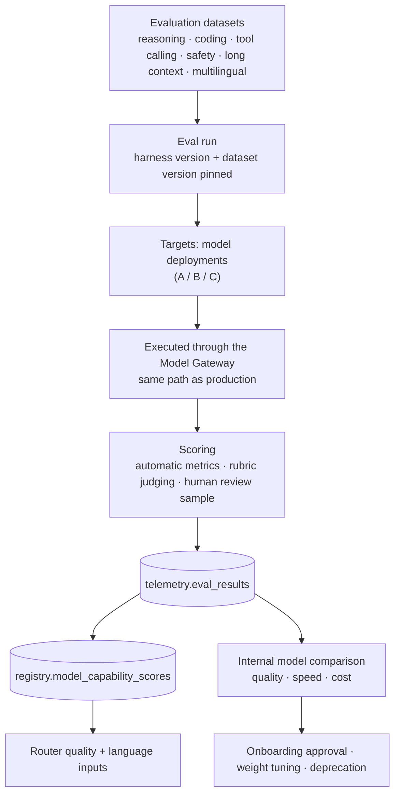

# Observability, Metering and Evaluation

**Status:** Draft for review (Phase 0) · **Last updated:** 2026-08-13

Janus must be able to answer, for any request: **what happened, which model served it, why that model, how long it took, what it cost, and whether quality held.** That requirement shapes the telemetry design rather than being bolted on later.

Related: [architecture.md](./architecture.md) · [model-routing.md](./model-routing.md) · [database.md](./database.md) · [security.md](./security.md)

---

## 1. Pillars

| Pillar | Technology | Purpose |
|--------|-----------|---------|
| Traces | OpenTelemetry → OTLP collector → backend (X-Ray or vendor) | End-to-end request path across web, api, runtime, gateway, providers |
| Metrics | OpenTelemetry metrics → CloudWatch / Prometheus-compatible store | SLOs, autoscaling signals, GPU utilization |
| Logs | Structured JSON → CloudWatch Logs | Debugging, audit correlation |
| LLM traces | Runtime tracing sink (LangSmith optional, self-hosted alternative acceptable) | Prompt/graph-level debugging, opt-in per organization |
| Domain records | PostgreSQL (`telemetry.*`) | Routing decisions, usage, evaluations — queryable product data, not just ops telemetry |

The distinction matters: routing decisions and usage records are **product data** with contractual meaning (explainability, billing), so they live in the database, not only in a metrics backend with short retention.

---

## 2. Correlation

One identifier chain ties everything together:

```text
trace_id      (W3C traceparent, propagated from the edge)
  └─ request_id  (rq_…, one per inference request; returned in every response)
       ├─ chat.messages.request_id
       ├─ agent.agent_steps.request_id
       ├─ telemetry.routing_decisions.request_id   (unique)
       └─ telemetry.usage_records.request_id
conversation_id / agent_run_id  (session-level grouping)
organization_id                 (tenant attribution on every span)
```

Given a user complaint referencing a single message, an operator can retrieve the trace, the routing decision with its candidate set, the usage and cost, and the agent steps — without content access if policy forbids it.

---

## 3. Tracing

### 3.1 Span structure

```text
POST /v1/conversations/{id}/messages          janus-api
├── auth.authenticate
├── policy.resolve
├── db.persist_user_message
└── runtime.chat_graph                        AI Runtime
    ├── retrieval.query_rewrite
    │   └── gateway.embeddings                janus-gateway
    │       └── backend.openai_compatible     provider call
    ├── retrieval.vector_search
    └── gateway.chat_completions              janus-gateway
        ├── classification.evaluate
        ├── policy.enforce
        ├── router.select                     ← candidate count, decision_ms
        ├── health.gate
        ├── backend.sarvam_api                ← attempt 1
        │   └── http.request
        ├── stream.relay                      ← ttft_ms, chunk count
        └── usage.record
```

### 3.2 Required span attributes

| Attribute | Notes |
|-----------|-------|
| `janus.request_id`, `janus.organization_id` | Always |
| `janus.user_id`, `janus.api_key_id` | When applicable |
| `janus.mode`, `janus.classification` | Policy context |
| `janus.model.requested`, `janus.model.selected`, `janus.deployment` | Routing outcome |
| `janus.provider`, `janus.backend`, `janus.region` | Egress facts |
| `janus.tokens.input/output/cached`, `janus.cost_usd` | Accounting |
| `janus.ttft_ms`, `janus.tokens_per_second` | Perceived performance |
| `janus.fallback_used`, `janus.fallback_attempts` | Reliability |
| `janus.policy_id`, `janus.policy_version` | Auditability |
| `janus.capability_downgraded` | Honesty about degradation |

**Never** in span attributes or logs: prompt or completion text, chain-of-thought, provider API keys, internal endpoint hostnames, personal data beyond identifiers. Sampling: 100% of errors and slow requests, head-based sampling for the rest, always-on for the domain records in Postgres.

---

## 4. Routing decision log

Every request writes one `telemetry.routing_decisions` row ([database.md](./database.md#9-telemetry-and-accounting-telemetry)) containing requested model, mode, classification, requirements, policy id and version, weight profile, the **candidate set with per-candidate exclusion reason or score components**, the selection, fallback attempts, decision latency, and any error.

This is what makes "why did you choose this model?" answerable months later:

| Audience | View |
|----------|------|
| End user | One safe sentence: *"Selected a Janus-hosted long-context model because this request requires document reasoning under your private-only policy."* |
| Organization admin | Selected model, deployment, privacy level, fallback status, cost, and which policy applied |
| Platform operator | Full record including candidates, exclusions, and score components |

Never exposed at any level: model chain-of-thought, internal endpoints, other tenants' data.

Operational uses: routing-quality review, detecting policies that silently exclude everything, provider reliability comparison, and regression detection when weights change.

---

## 5. Agent run telemetry

Per run (`agent.agent_runs`) and per step (`agent.agent_steps`): node name, model and deployment used, tokens, cost, latency, tool invocations with results, errors, and halt reason.

Operators and users can answer: what did the agent do, which model served each step, what did each step cost, which tools ran and with what outcome, where did it stall or loop, and why did it stop. The user-facing timeline shows steps and tool activity; the scratchpad stays internal ([security.md](./security.md#10-model-output-handling)).

---

## 6. Usage metering

Every call writes a `telemetry.usage_records` row — including failures and cancellations, which still consume provider capacity and sometimes cost money.

### 6.1 Cost basis

| Deployment type | Basis | Honesty requirement |
|-----------------|-------|---------------------|
| Provider cloud | Versioned price table (`registry.model_prices`) × tokens | Reconciled monthly against provider invoices; discrepancies investigated |
| Janus GPU | Amortized GPU-hour cost ÷ measured throughput | Labeled **estimate** wherever displayed |
| Local / dev | Zero, labeled as such | Never presented as production cost |

Prices are never hard-coded: a price change is a new `model_prices` row with an effective date, and historical usage keeps the price version that applied.

### 6.2 Aggregation

Raw records feed `usage_rollups_daily` (per org, day, model, deployment, operation) via a worker job. Dashboards read rollups; raw records serve drill-down. Cost attribution granularity — organization, user, conversation, agent run — is an open question, though all four identifiers are captured so the decision is reversible.

### 6.3 Quota enforcement

Pre-flight estimate against remaining quota, post-flight reconciliation against actuals. Exceeding a cost ceiling returns `quota_exceeded` rather than degrading silently.

---

## 7. Metrics and SLOs

| Metric | Type | Purpose |
|--------|------|---------|
| `janus.request.count` | counter (by endpoint, status, org) | Traffic |
| `janus.ttft` | histogram (by model, deployment) | Perceived latency — the number users feel |
| `janus.request.duration` | histogram | Total latency |
| `janus.gateway.overhead` | histogram | Abstraction tax; budgeted < 25 ms p95 |
| `janus.router.decision_ms` | histogram | Routing cost |
| `janus.tokens` | counter (in/out, by model) | Volume |
| `janus.cost_usd` | counter (by org, deployment) | Spend |
| `janus.streams.active` | gauge | Gateway autoscaling signal |
| `janus.fallback.count` | counter (by from→to) | Provider reliability |
| `janus.deployment.state` | gauge | Fleet health |
| `janus.deployment.queue_depth` | gauge | Saturation |
| `gpu.utilization`, `gpu.vram` | gauge (Phase 8, DCGM) | GPU efficiency |
| `janus.policy.blocked` | counter (by constraint) | Over-restrictive policies |
| `janus.tool.duration` | histogram (by tool) | Agent performance |

### 7.1 SLOs (from Phase 7)

| SLO | Target |
|-----|--------|
| Chat availability (non-5xx, excluding provider-attributed failures) | 99.9% monthly |
| TTFT p95, interactive chat, healthy fleet | < 2.5 s |
| Gateway overhead p95 | < 25 ms |
| Router decision p95 | < 10 ms |
| Ingestion completion p95 (documents < 10 MB) | < 5 min |
| Error budget policy | Burn > 50% in a week freezes feature deploys in favor of reliability |

Provider-attributed failures are tracked separately so Janus reliability and vendor reliability are not conflated — but repeated vendor failure is a Janus problem and drives routing weights.

---

## 8. Alerting

| Alert | Condition | Response |
|-------|-----------|----------|
| Elevated 5xx | Error rate above threshold, sustained | Page |
| Provider degradation | Per-provider error rate or latency spike | Auto-deprioritize in routing; notify |
| All candidates failing for a capability class | Fallback exhaustion events | Page — potential platform-wide gap |
| Policy blocking everything | `policy.blocked` spike for one org | Notify org admin path; review policy |
| Cost anomaly | Org or deployment spend deviates from baseline | Notify; investigate abuse or a routing regression |
| GPU idle burn | Low utilization with high cost, sustained | Right-size or enable scale-to-zero |
| Deployment stuck warming | State unchanged beyond expected cold-start window | Page |
| Capability verification failure | Declared capability fails conformance or eval | Auto-disable flag; notify ML owner |
| Quota exhaustion | Org near or at limits | Notify customer-facing path |

Every alert names a runbook. Alerts without an action are deleted rather than tolerated.

---

## 9. Evaluation and benchmarking



| Rule | Rationale |
|------|-----------|
| Evaluations run **through the gateway**, not directly against providers | Measures what users actually get, including gateway overhead |
| Harness and dataset versions are pinned on every result | Comparability over time |
| Only harness-produced numbers may be displayed anywhere | No fabricated or third-party benchmarks ([model-registry.md](./model-registry.md#9-presentation)) |
| Capability claims are verified, not trusted | A failed verification disables the flag and alerts |
| Language quality is measured **per language**, not as one multilingual score | An aggregate hides failures; per-language scores are what make the multilingual tier (including Indic) defensible |
| Safety metrics are tracked per model | Required for enterprise assurance |
| Evaluation datasets containing customer data require explicit opt-in | Privacy |

Routing weights are tuned only against measured evidence, and weight changes are diffed against golden routing fixtures so their effect is visible before rollout ([model-routing.md](./model-routing.md#10-testing)).

---

## 10. Retention

| Data | Proposed retention | Notes |
|------|--------------------|-------|
| Traces | 7–30 days | Sampled; errors kept longer |
| Application logs | 30 days hot, 1 year archived to S3 | No prompt bodies |
| `routing_decisions` | 90 days hot, then S3 (partitioned) | Explainability window |
| `usage_records` | 13 months hot | Billing reconciliation and year-over-year |
| `usage_rollups_daily` | Indefinite | Small, high value |
| `health_samples` | 90 days | Capacity trends |
| `agent_steps.scratchpad` | 30 days (proposed) | Shortest useful debugging window; privacy-driven |
| `checkpoints` | 7 days after run completion | Resumability only |
| `audit_events` | 1–7 years | Compliance-driven, per requirement |
| Conversations / documents | Until user deletion, per org policy | Deletion cascades to chunks and derived data |

All values are proposals for review; retention is configurable per organization where contracts require it.

---

## 11. Dashboards

| Dashboard | Audience | Content |
|-----------|----------|---------|
| Platform health | Engineering | SLOs, error rates, TTFT, gateway overhead, queue depth |
| Model fleet | ML / Infra | Per-deployment state, latency, throughput, error rate, GPU utilization |
| Routing quality | ML / Product | Model mix, Auto-mode distribution, fallback rates, policy blocks |
| Cost | Finance / Engineering | Spend by org, model, deployment; cost per request; GPU efficiency |
| Organization usage (in-product) | Customers | Their own requests, tokens, cost, model mix |
| Agent performance | Product | Run success, steps per run, tool failures, halt reasons |
| Evaluation | ML | Quality by capability and language, trend across harness runs |

---

## 12. Open questions

1. Metrics backend: CloudWatch only, or Prometheus/Grafana (self-hosted or managed) for higher-cardinality model metrics?
2. LLM tracing: LangSmith (fast, external processor implications) or a self-hosted OTLP-based approach for sovereign customers?
3. Is prompt/completion capture ever enabled? Recommendation: off by default, per-organization opt-in, separately access-controlled, excluded from `RESTRICTED` data.
4. Cost attribution granularity to expose in-product: organization, user, agent, conversation?
5. Who owns the evaluation datasets and cadence? English reasoning, coding, and safety sets are needed for the US launch; per-language sets (including Indic) follow with the multilingual tier.
6. Do customers get an API for their own routing decisions and usage records (transparency feature), or dashboard-only?
