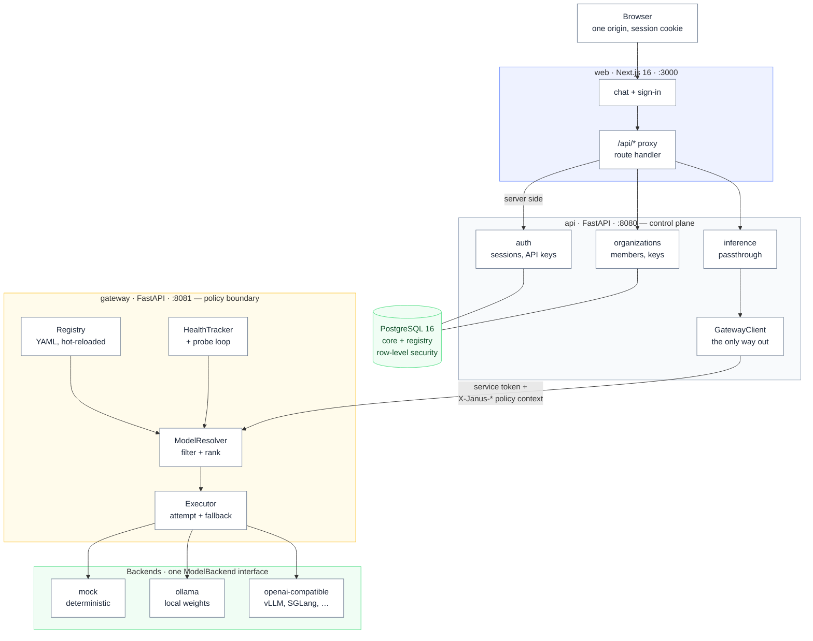
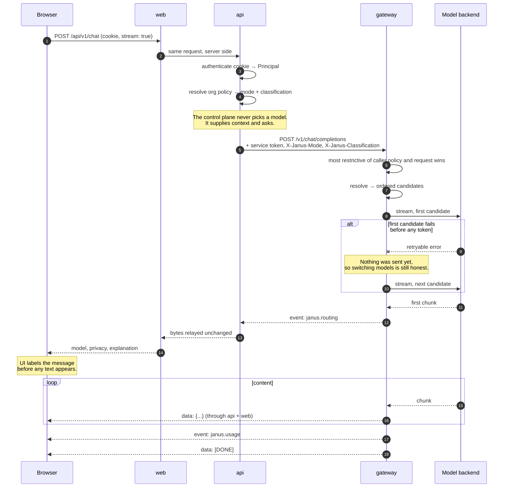
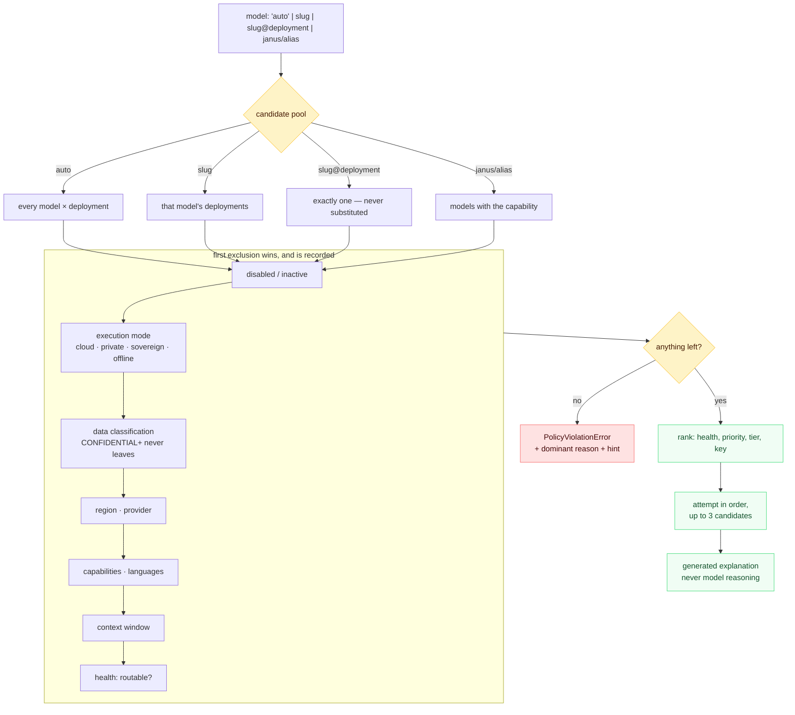
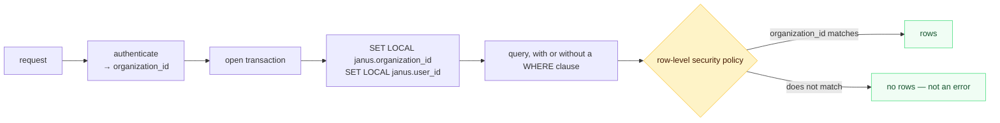
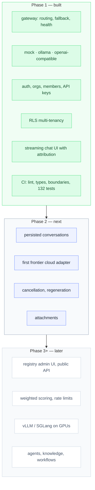

# Phase 1 — As Built

**Status:** complete · **Last updated:** 2026-08-13

[architecture.md](./architecture.md) describes where Janus is going. This document
describes what actually runs today, so the two can be read side by side and the gap
is always visible.

One sentence: a message travels browser → control plane → gateway → model and comes
back labeled with the model that produced it.

---

## 1. What runs

Four services, plus a one-shot migration job that must finish before the API starts.
The **only** path to a model is through the gateway
([ADR 0001](./adr/0001-gateway-sole-inference-path.md)), and that is enforced
mechanically — import-linter contracts fail the build if the control plane imports a
provider SDK or the gateway package.



Ports shown are container ports; what gets published to the host is configurable
through `JANUS_WEB_PORT`, `JANUS_API_PORT`, and `JANUS_GATEWAY_PORT`.

Why the web server proxies rather than letting the browser call the API directly:
sessions stay same-origin, CORS never applies, and remote access needs one reachable
port instead of two — which is what makes the stack usable over an SSH tunnel or a
Tailscale address.

---

## 2. A streaming message, end to end

The ordering here is the product. Routing metadata is emitted **before** the first
token, so the UI can say which model is answering while the answer is still arriving.



Once a single token has reached the client, the model is fixed. Silently switching
mid-answer would make the attribution a lie, so a later failure surfaces as a
terminal `janus.error` event instead.

---

## 3. How a model gets chosen

Constraints are hard and rejections are counted, so "no model available" always comes
with a reason rather than a shrug.



Two rules in that diagram are load-bearing and deliberately not configurable:
a pinned deployment is never substituted, and `CONFIDENTIAL` or higher never reaches
an external provider whatever mode was requested.

---

## 4. Where tenancy is enforced

In the database, not in application code
([ADR 0005](./adr/0005-multi-tenancy-rls.md)). A repository that forgets a
`WHERE organization_id = …` returns nothing instead of another tenant's rows.



Three details make that diagram hold up rather than merely look reassuring. The
services connect as `janus_app`, which has neither `BYPASSRLS` nor `SUPERUSER`.
Tenant tables are `FORCE ROW LEVEL SECURITY`, so the policies apply even to the table
owner. And `SET LOCAL` is scoped to the transaction, so a pooled connection cannot
carry one request's tenant context into the next.

Authentication itself is the one path that runs with **no** tenant scope, through a
narrow `SECURITY DEFINER` function: a key's organization is the *result* of
authentication, so it cannot also be an input to it.

---

## 5. Scope



Deliberately **not** built yet, so nobody goes looking for it:

| Not here | Why |
|----------|-----|
| Persisted conversations | Phase 2. The inference route is a passthrough; nothing is stored. |
| Redis | Nothing caches, rate-limits, or holds shared state until Phase 3. Sessions live in Postgres. |
| Cloud provider adapters | The interface and its conformance suite exist; the first frontier adapter lands in Phase 2. |
| Weighted routing scores | Phase 1 ranks deterministically by health, priority, and tier. Scoring is Phase 3. |
| Durable usage records | Usage is computed and logged per request, but not yet billable state. |

---

## 6. Verifying it yourself

```bash
make stack-up                 # postgres, migrations, gateway, api, web
curl -s localhost:${JANUS_API_PORT:-8080}/readyz # {"status":"ready","checks":{...,"schema":"ok",...}}
make check                    # lint, types, boundaries, web checks, tests
```

The mock backend answers with no API key and no GPU, so the whole path above is
verifiable on a laptop. Its control tokens exercise the failure paths on purpose:

| Token in the last user message | Effect |
|---|---|
| `__fail__` | retryable failure on every deployment |
| `__fail_on__:<key>` | failure on one deployment — proves fallback |
| `__auth_fail__` | non-retryable credential failure |
| `__ratelimit__` · `__timeout__` | provider rate limit · request-budget timeout |
| `__slow__:<s>` · `__delay__:<s>` | delay before first token · between chunks |
| `__tokens__:<n>` | emit n chunks |

`__delay__` is the one to reach for when checking that nothing in the path buffers:
chunks should arrive spread out, not all at once at the end.
