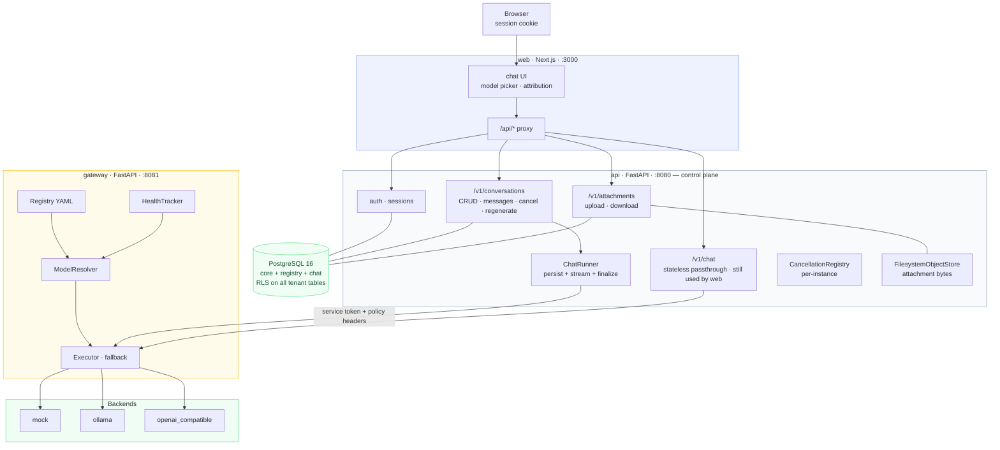
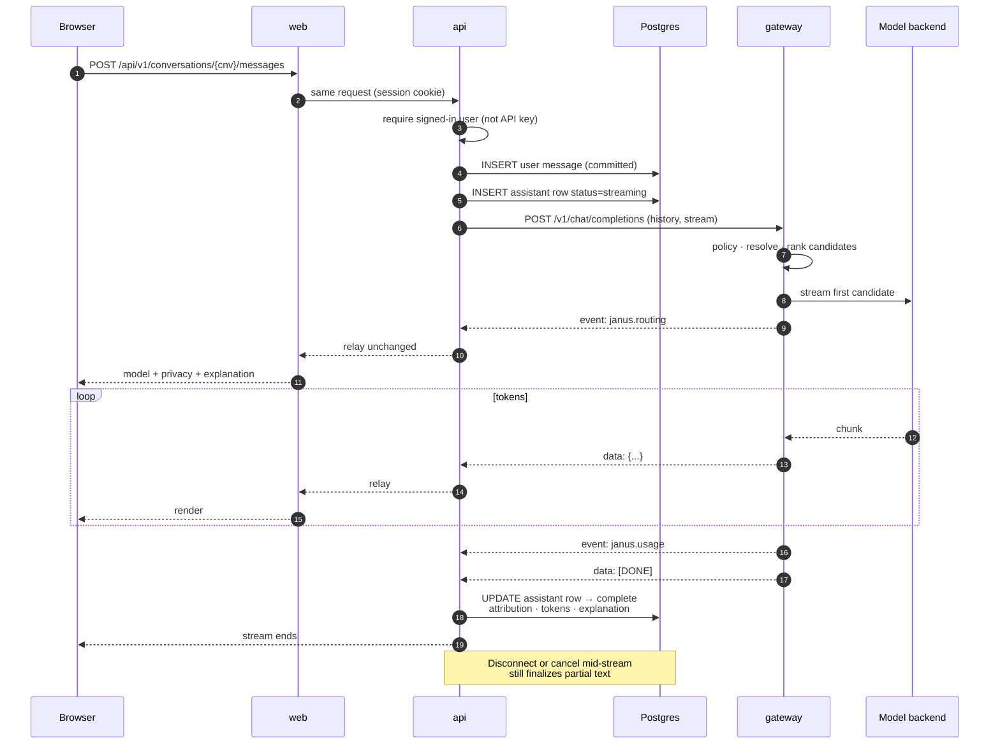
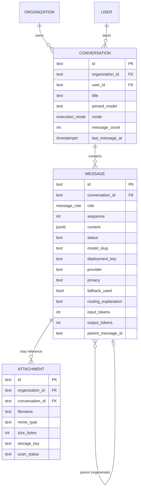
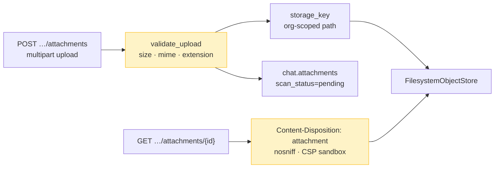
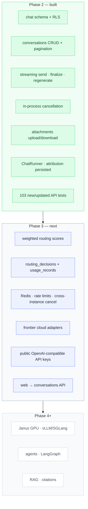

# Phase 2 — As Built

**Status:** complete · **Last updated:** 2026-08-14

[architecture.md](./architecture.md) describes where Janus is going. This document
describes what Phase 2 actually shipped — persisted chat, attachments storage,
and the control-plane path that turns streaming inference into durable history.

One sentence: a signed-in user sends a message to a **conversation**; the control
plane saves it, streams an answer from the gateway, and finalizes the assistant
turn with full model attribution — even when the model fails or the user cancels.

---

## 1. What runs

Phase 2 extends the Phase 1 stack. The gateway boundary is unchanged: still the
only path to a model. What is new is the **`chat` schema** in Postgres and the
**`/v1/conversations`** API that owns product state.



**185 automated tests** pass (103 control plane · 82 gateway). Phase 1 had 132.

---

## 2. A conversation turn, end to end

The product API is **`POST /v1/conversations/{id}/messages`**, not raw chat
completions. The user's text is committed **before** the model is called, so a
provider failure never loses what they typed.



**Regeneration** appends a new assistant message with `parent_message_id` pointing
at the old attempt; finalized messages are immutable (database trigger).

**Cancel** (`POST /v1/conversations/{id}/cancel`) signals in-flight generations on
**this API instance only** until Phase 3 adds Redis pub/sub.

---

## 3. Chat data model



Design choices (migration `0002_chat.py`):

| Choice | Rationale |
|--------|-----------|
| Attribution as slugs, not FKs to `registry.models` | Catalog is still YAML; FKs to empty registry tables would block writes |
| Immutable finalized messages | Trigger rejects updates once `status ≠ streaming` |
| Atomic sequence counter on conversation | Two tabs sending at once get distinct sequences |
| No `chat.citations` yet | Retrieval is Phase 6 |
| Soft-delete conversations | Transcripts are not hard-deleted from request paths |

---

## 4. Attachments (storage only)



Nothing parses PDFs, extracts text, or sends bytes to a model — that is Phase 6.
`scan_status` stays **`pending`** so unscanned files are never assumed clean.

---

## 5. Scope



### Deliberately not built yet

| Not here | Why |
|----------|-----|
| Web wired to `/v1/conversations` | UI still calls stateless `/v1/chat`; history is API-ready, web catches up in Phase 3 |
| Frontier cloud adapters in registry | Interface exists; first provider entries + credentials land in Phase 3 |
| Redis | Rate limits, shared health, cross-tab cancel — Phase 3 |
| Durable routing/usage tables | Logged structurally; Postgres persistence — Phase 3 |
| Weighted scoring | Phase 1/2 rank by health · priority · tier; scoring — Phase 3 |
| Document parsing / RAG | Phase 6 |
| Thread sidebar in web | Phase 3 catalog UI |

---

## 6. Key files

| Area | Path |
|------|------|
| Migration | `services/api/migrations/versions/0002_chat.py` |
| Conversations API | `services/api/api_app/routers/conversations.py` |
| Chat streaming + DB | `services/api/api_app/chat_stream.py` |
| Domain logic | `services/api/api_app/conversations.py` |
| Attachments | `services/api/api_app/routers/attachments.py`, `storage.py` |
| Cancellation | `services/api/api_app/cancellation.py` |
| Tests | `services/api/tests/test_conversations.py`, `test_attachments.py`, `test_sse.py` |

---

## 7. Verifying it yourself

On this machine ports 3000/8080 are taken, so the stack publishes API **8090** and
web **3010** (see `.env`). The default in the examples is 8080.

```bash
make stack-up
make test-api          # needs Postgres
make test-gateway

API="localhost:${JANUS_API_PORT:-8080}"

# Sign in (or register) so curl has a session cookie:
curl -s -c cookies.txt -X POST "$API/v1/auth/register" \
  -H 'Content-Type: application/json' \
  -d '{"email":"you@example.com","password":"correct-horse-battery","name":"You","organization_name":"Acme"}'

curl -s -b cookies.txt -X POST "$API/v1/conversations" \
  -H 'Content-Type: application/json' -d '{}'
curl -s -N -b cookies.txt -X POST "$API/v1/conversations/cnv_…/messages" \
  -H 'Content-Type: application/json' -d '{"content":"Hello"}'
```

Reload the conversation — history and model attribution survive:

```bash
curl -s -b cookies.txt "$API/v1/conversations/cnv_…"
```
