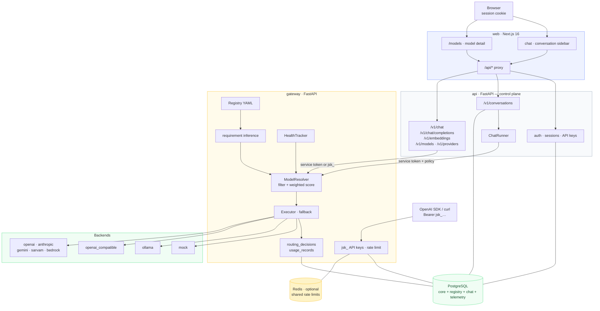
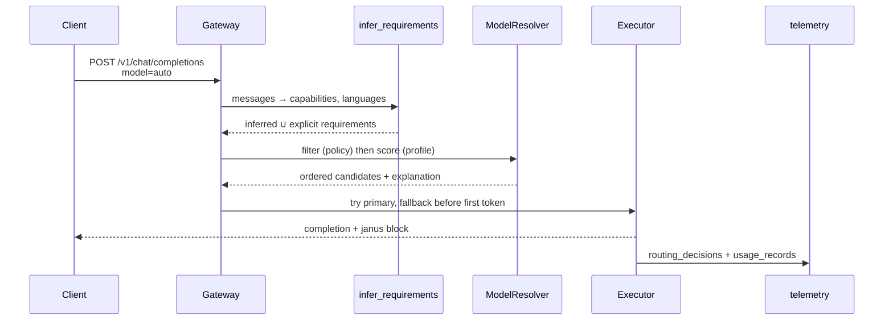
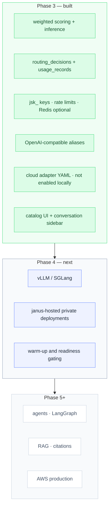

# Phase 3 — As Built

**Status:** complete · **Last updated:** 2026-08-14

[architecture.md](./architecture.md) describes where Janus is going. This document
describes what Phase 3 actually shipped — the gateway as a public product surface:
OpenAI-compatible clients, Auto routing that can explain itself, durable decision
and usage records, and a catalog the web app can browse.

One sentence: an unmodified OpenAI SDK can point at Janus; Auto picks a model for
a reason that is stored; the chat UI talks to conversations, not a stateless
passthrough.

---

## 1. What runs

Phase 3 keeps the Phase 1/2 topology. What changed is that the gateway is no longer
an internal hop the control plane hides: it is the inference API, the catalog is a
page, and every completion writes a decision.



Ports in the diagram are **container** ports. Host publish ports remain
`JANUS_WEB_PORT`, `JANUS_API_PORT`, and `JANUS_GATEWAY_PORT` from `.env`.

---

## 2. How a request is routed



Inference is cheap and deterministic ([model-routing.md](./model-routing.md) §4):
code fences → `coding`, Devanagari → `hi` + `indic`, images → `vision`, long text →
`long_context`. Explicit `janus.requirements` always win where they are set.

Scoring is weighted ([model-routing.md](./model-routing.md) §5). Profiles:
`balanced`, `quality_first`, `speed_first`, `cost_optimized`, `privacy_first`.
Eligibility is still a filter — a candidate that violates policy is excluded, not
down-ranked.

Auto on a Hindi prompt therefore lands on `janus/mock-reasoning` (Indic + `hi`),
not `janus/mock-small` (English-only). English "Hello" still prefers the local
mock because it is healthy, cheaper on latency, and higher priority.

---

## 3. Public OpenAI-compatible surface

| Method | Path | Who |
|--------|------|-----|
| `POST` | `/v1/chat/completions` | Gateway (canonical) and control plane (alias of `/v1/chat`) |
| `POST` | `/v1/embeddings` | Both |
| `GET` | `/v1/models`, `/v1/models/{id}` | Both; `{id}` is a path so `janus/mock-small` is not percent-encoded |
| `GET` | `/v1/providers` | Both |

An OpenAI SDK sets `base_url` at the control plane's `/v1` (session or `jsk_` key)
or directly at the gateway with a `jsk_` key. The `janus` block is ignorable.

Gateway public keys are rate-limited per organization (Redis when
`JANUS_REDIS_URL` is set, in-process otherwise). Catalog listing is the same
eligibility filter the router uses, so a caller never sees a model policy would
refuse.

---

## 4. Registry

The catalog is still **configuration-as-code**. Admin "CRUD" is a reviewed YAML
change plus `POST /internal/registry/reload`. Endpoints and credential references
never appear in `/v1/models`.

Frontier adapters (OpenAI, Anthropic, Gemini, Sarvam, Bedrock) have model files
and working backend classes. Their deployments are **absent from `test` and
`local` overlays**, so CI cannot reach a provider. Enabling one is adding its
deployment key to `registry/environments/<env>.yaml` after the credential
(`env://OPENAI_API_KEY`, and so on) exists. Metadata stays `metadata_verified:
false` until the evaluation harness measures it.

Capability aliases already on the mocks: `janus/fast`, `janus/coding`,
`janus/reasoning`, `janus/multilingual`. Sarvam declares `janus/indic` for when
that deployment is enabled.

---

## 5. Web

The chat UI creates a conversation on the first send and streams
`POST /v1/conversations/{id}/messages`. A sidebar lists threads; `?c=` in the URL
is the open conversation. `/models` and `/models/[...id]` are the catalog. The
stateless `POST /v1/chat` path remains for programmatic callers and parser tests.

---

## 6. Scope



### Deliberately not built yet

| Not here | Why |
|----------|-----|
| Postgres-backed registry writes | Catalog mutations stay pull requests; reload applies them |
| Shared health in Redis | Health is still per-instance; Redis is used for rate limits |
| Cross-instance cancel | Cancellation is still in-process on the API (Phase 2) |
| Provider credentials in local/prod | Overlays do not enable cloud deployments without a review |
| Document parsing / RAG | Phase 6 |
| Janus GPU / vLLM / SGLang | Phase 4 |

---

## 7. Key files

| Area | Path |
|------|------|
| Requirement inference | `services/gateway/gateway_app/router/infer.py` |
| Weighted scoring | `services/gateway/gateway_app/router/scoring.py` |
| Telemetry writer | `services/gateway/gateway_app/telemetry/writer.py` |
| Public API keys + rate limit | `services/gateway/gateway_app/deps.py`, `rate_limit.py` |
| Control-plane aliases | `services/api/api_app/routers/inference.py` |
| Cloud adapters | `services/gateway/gateway_app/backends/{openai,anthropic,gemini,sarvam,bedrock}.py` |
| Registry YAML | `registry/models/*.yaml` |
| Catalog + chat UI | `apps/web/src/components/{Catalog,ModelDetail,Chat}.tsx` |
| Migration | `services/api/migrations/versions/0003_telemetry.py` |

---

## 8. Verifying it yourself

```bash
make stack-up
make smoke-chat          # conversation create + stream (unchanged)
make test-gateway        # includes Auto Hindi routing, jsk_ keys, telemetry stub
make test-api            # includes /v1/chat/completions and /v1/embeddings aliases
make web-test            # SSE parser, including conversation streams
```

Point an OpenAI-compatible client at the **control plane** `/v1` with a session
cookie or a `jsk_` key created under `/v1/organizations/current/api-keys`. Direct
gateway access with a `jsk_` key is the same surface without the conversation
product around it.

Hindi Auto check against the mock catalog:

```bash
curl -s -b cookies.txt -X POST "$API/v1/chat/completions" \
  -H 'content-type: application/json' \
  -d '{"model":"auto","messages":[{"role":"user","content":"इस अनुबंध का सारांश दें।"}]}' \
  | jq .janus.model
# "janus/mock-reasoning"
```

Do not copy ports from this document. Use the URLs `make stack-up` printed.
