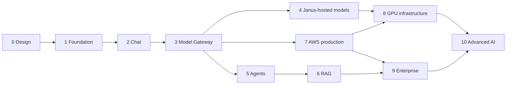

# Implementation Roadmap

**Status:** Phases 0–10 as-built slices complete · **Last updated:** 2026-08-14

Ten phases. Each is a reviewable increment with explicit exit criteria; none begins until the previous one meets them.

Every phase ships: objective · architectural decisions · files created/modified · implementation · tests · security review · performance review · documentation.

---

## Phase 0 — Design ✓

| | |
|---|---|
| **Objective** | Agreed architecture, domain model, schema, API contract, and roadmap |
| **Deliverables** | The eleven documents in `docs/`, repository structure, database schema, API contract, model registry schema |
| **Exit criteria** | Reviewers approve architecture, domain model, schema, and API contract; the six open questions in [architecture.md §14](./architecture.md#14-open-questions) are answered; Sarvam assumptions verified against provider documentation |
| **Gate** | **No application code until this passes.** |

---

## Phase 1 — Foundation ✓

Diagrams of what this phase actually produced are in [phase-1.md](./phase-1.md).

| | |
|---|---|
| **Objective** | A deployable skeleton with the abstractions that matter already in place |
| **Scope** | Monorepo and tooling · Docker Compose · Next.js shell · FastAPI `janus-api` and `janus-gateway` · Aurora-compatible Postgres schema (core + registry) with Alembic · authentication (email/password, sessions, API keys) · organizations and membership · `ModelBackend` interface with **`MockBackend` and `OllamaBackend`** · registry-as-code loader · OpenTelemetry wiring · structured logging · CI |
| **Key decisions** | Provider abstraction exists from the first commit; runtime is a library inside `janus-api` ([ADR 0004](./adr/0004-ai-runtime-boundary.md)) |
| **Deferred** | **Redis** — nothing caches, rate-limits, or holds shared state until Phase 3, and an unused dependency is an unused attack surface. Sessions live in Postgres, and health state is per-instance and rebuilt on start. |
| **Tests** | 132 tests: routing and policy resolution, streaming and fallback, auth, RLS cross-tenant isolation, browser SSE parsing, adapter conformance on mock (Ollama conformance opt-in via `JANUS_TEST_OLLAMA=1`) |
| **Security review** | Argon2id password and key hashing · lookup-hash indirection so key authentication needs no cross-tenant table scan · `SECURITY DEFINER` authentication function returning only authentication fields · RLS `FORCE`d on tenant tables and the service role holding neither `BYPASSRLS` nor `SUPERUSER` · append-only audit events · no secrets in the repository |
| **Performance review** | Gateway overhead against the mock backend is dominated by policy resolution, which is in-process and allocation-light; there is no network hop between resolution and dispatch. Measured budgets (router p95 < 10 ms, gateway p95 < 25 ms) are Phase 3 exit criteria, when the decision log exists to measure them with. |
| **Exit criteria** | `make stack-up` gives a working local stack ✓ · a request flows web → api → gateway → model ✓ · cross-tenant access tests pass ✓ · CI enforces boundary rules ✓ |

---

## Phase 2 — Chat ✓

Diagrams of what this phase produced are in [phase-2.md](./phase-2.md).

| | |
|---|---|
| **Objective** | A chat product people can use daily |
| **Scope** | Conversations and messages · SSE streaming end to end · model selector · conversation history · cancellation and regeneration · attachments (upload + storage, parsing deferred) |
| **Key decisions** | Web uses `/v1/conversations/{id}/messages` for the product API; model attribution stored on every assistant message; stateless `/v1/chat` remains for programmatic callers |
| **Tests** | 103 control-plane tests including streaming, cancellation, regeneration, attachments, tenant isolation |
| **Exit criteria** | Streaming chat with persisted history, correct model attribution, immutable finalized messages ✓ |

---

## Phase 3 — Model Gateway ✓

Diagrams of what this phase produced are in [phase-3.md](./phase-3.md).

| | |
|---|---|
| **Objective** | The gateway becomes a real product surface, not an internal detail |
| **Scope** | Model registry (YAML + reload) · model catalog UI and model detail pages · remaining adapters (**Anthropic/OpenAI, Gemini, Bedrock, Sarvam**) as registry entries · public OpenAI-compatible endpoints (`/v1/chat/completions`, `/v1/embeddings`, `/v1/models`, `/v1/providers`) · health tracking · deterministic router with filters and scoring · **Auto mode** · capability aliases · routing decision log · usage records and cost calculation · rate limiting |
| **Key decisions** | Constraints hard / preferences soft; decision log from day one ([model-routing.md](./model-routing.md)); catalog mutations are pull requests, not a console |
| **Tests** | Requirement inference, Hindi Auto routing, `jsk_` authentication, rate limits, telemetry persist stub, control-plane OpenAI aliases, catalog/conversation SSE parser |
| **Security review** | Credential isolation (registry holds `env://` references only) · catalog filtered by the same eligibility rules as routing · public keys cannot widen mode · endpoints never in `/v1/models` |
| **Performance review** | Resolution stays in-process; scoring is arithmetic over the already-filtered candidate list. Load-tested p95 budgets wait for Phase 7 traffic. |
| **Exit criteria** | An external OpenAI SDK client works against Janus ✓ · Auto mode picks sensibly ✓ · every request has an explainable decision record ✓ |

---

## Phase 4 — Janus-hosted and local models ✓

| | |
|---|---|
| **Objective** | Models on infrastructure Janus controls, behind the same gateway |
| **Scope** | **vLLM and SGLang adapters** · llama.cpp and MLX adapters for local/edge · deployment registry with hardware metadata · warm-up controller and readiness gating · health probes from workers · cross-plane fallback · deployment admin UI · `private` execution mode |
| **Key decisions** | Same weights in two places = one model, two deployments |
| **Tests** | Warming-state routing exclusion, fallback across planes, deployment-qualified model references |
| **Security review** | Private-subnet endpoints, no internet egress from inference, endpoint values never exposed |
| **Performance review** | Cold-start behavior, warm-pool effectiveness, throughput per runtime |
| **Exit criteria** | A self-hosted model serves production-shaped traffic (staging GPU or DGX Spark); `private` mode verifiably keeps data off external providers |

---

## Phase 5 — Agents ✓

| | |
|---|---|
| **Objective** | Agents as versioned, governed artifacts |
| **Scope** | Agent CRUD, versioning, publishing · LangGraph execution with Postgres checkpointing · tool registry (native, REST, function) · **MCP client** · per-step model policies · human-in-the-loop approval · conversation summary memory · agent builder UI · run timeline UI · `/v1/responses` |
| **Key decisions** | Graph nodes never name a provider; tool output is untrusted data |
| **Tests** | Resume from checkpoint, budget and step-limit halts, tool timeout handling, injection resistance |
| **Security review** | Tool allow-listing, side-effect classification, approval gates, credential handling, scratchpad exposure |
| **Performance review** | Steps per run, cost per run, per-step routing effectiveness |
| **Exit criteria** | A published agent completes a multi-step task with tools, correct per-step model selection, full run telemetry, and no chain-of-thought leakage |

---

## Phase 6 — RAG and knowledge ✓

| | |
|---|---|
| **Objective** | Grounded answers with citations |
| **Scope** | Document upload and parsing (PDF, DOCX, HTML, text) · structure- and script-aware chunking · embeddings through the gateway · pgvector storage with HNSW · hybrid search · reranking · citation binding · knowledge base management UI · ingestion pipeline on workers |
| **Key decisions** | Embedding model pinned per knowledge base; mixed-version search refused |
| **Tests** | Ingestion idempotency, dedupe, citation accuracy, non-Latin script chunking, retrieval latency |
| **Security review** | Document classification propagation, org-scoped vector search, pre-signed URL scoping |
| **Performance review** | Retrieval p95, ingestion throughput, index size growth |
| **Exit criteria** | Documents in, cited answers out, org-isolated retrieval verified, re-embedding path exercised |

---

## Phase 7 — AWS production ✓ (Terraform + runbook; apply is operator-driven)

| | |
|---|---|
| **Objective** | Production deployment with real operational discipline |
| **Scope** | Terraform for network, edge, ALB, ECS services, Aurora, Redis, S3, SQS, Secrets Manager, ECR, observability · CI/CD with migration gates · dashboards, alerts, runbooks · SLOs and error budgets · backups and a rehearsed restore · WAF and CloudFront · load testing |
| **Key decisions** | ECS Fargate for core; no EKS yet ([ADR 0003](./adr/0003-hybrid-ecs-eks.md)) |
| **Tests** | Infrastructure plan review, failover drill, restore drill, load test to target concurrency |
| **Security review** | IAM least privilege, network exposure, secret rotation, image hardening, WAF rules |
| **Performance review** | SLO baselines established under load; streaming through CloudFront/ALB verified |
| **Exit criteria** | Staging and production deploy from CI; SLOs measured; disaster recovery rehearsed; zero console-made changes |

---

## Phase 8 — GPU infrastructure (foundation)

| | |
|---|---|
| **Objective** | Janus operates its own GPU fleet economically |
| **Scope** | EKS cluster and IRSA · GPU node pools (realtime, large, batch) · vLLM and SGLang deployments · model controller reconciling the deployment registry · weights cache · scale-to-zero and warm pools · GPU autoscaling · DCGM metrics · per-deployment cost dashboards |
| **Key decisions** | Kubernetes only for GPU serving; hardware chosen by pool capability, never hard-coded |
| **Tests** | Autoscaling under load, cold-start budgets, node failure recovery, controller reconciliation |
| **Security review** | Pod isolation, network policies, no egress from inference pods, weights integrity via hash pinning |
| **Performance review** | Tokens/sec per GPU-hour, utilization, cost per million tokens versus provider pricing |
| **Exit criteria** | A large open-weight model serves production traffic on Janus GPUs at a defensible cost, with honest amortized cost reporting |

---

## Phase 9 — Enterprise (control-plane slice)

| | |
|---|---|
| **Objective** | Sellable to regulated organizations |
| **Scope** | Full RBAC · SSO (OIDC/SAML) and SCIM · teams · full policy engine with the constraint set in [security.md §7](./security.md#7-policy-engine) · policy simulation endpoint · data classification enforcement · **sovereign mode** · audit log UI and export · quotas and cost ceilings · usage dashboards · bring-your-own-key (candidate) · customer-managed KMS (candidate) · **SOC 2 Type II control readiness**, HIPAA/BAA path where healthcare demand appears |
| **Key decisions** | Constraints resolve most-restrictive-wins; no silent policy relaxation anywhere |
| **Tests** | Property tests on policy resolution, sovereign-mode egress verification, audit completeness |
| **Security review** | External audit readiness assessment; penetration test |
| **Performance review** | Policy resolution overhead; audit write throughput |
| **Exit criteria** | An organization can be configured so that confidential data provably never leaves Janus infrastructure, with an audit trail proving it |

---

## Phase 10 — Advanced AI (surfaces)

| | |
|---|---|
| **Objective** | Differentiation through breadth and measured intelligence |
| **Scope** | Multimodal (vision input, documents as first-class) · voice (speech-to-text and text-to-speech behind the same gateway) · advanced agents (planning, multi-agent delegation, long-term memory) · agent marketplace foundations · evaluation harness at scale with per-language evaluation sets (English first, then the multilingual tier including Indic) · evaluation-driven routing weight tuning · opt-in learned routing with A/B measurement · web search tool |
| **Key decisions** | Learned routing ships only if measured to help without weakening constraint safety |
| **Tests** | Modality conformance, voice latency, routing A/B integrity |
| **Security review** | Audio and image handling, memory privacy controls, marketplace permission model |
| **Performance review** | Voice round-trip latency; router quality versus the deterministic baseline |
| **Exit criteria** | Multimodal and voice available; routing improvements demonstrated with Janus-measured evidence |

---

## Dependencies

Phases 4 and 5 can proceed in parallel after Phase 3 given separate owners (ML Infrastructure and Applied AI). Phase 7 depends only on Phase 3 and can overlap with 4–6.

---

## Cross-phase requirements

Present in **every** phase, never deferred to a "hardening phase":

| Requirement | Applies from |
|-------------|-------------|
| Typed interfaces, dependency injection, structured logging, OpenTelemetry | Phase 1 |
| Migrations reviewed; forward-only; RLS on every tenant table | Phase 1 |
| Automated tests including cross-tenant isolation | Phase 1 |
| No secrets in code; Secrets Manager for all credentials | Phase 1 |
| Provider abstraction; no vendor branching outside adapters (CI-enforced) | Phase 1 |
| Usage, latency, and model selection recorded for every AI call | Phase 3 |
| Rate limiting, timeouts, retries, circuit breakers | Phase 3 |
| ADR for every architectural decision | Phase 0 |
| No fabricated benchmarks; no unsupported privacy claims | Phase 0 |

---

## Risks to the plan

| Risk | Mitigation |
|------|------------|
| Sarvam assumptions prove wrong | Verify in Phase 0; registry is data-driven so corrections are configuration |
| GPU availability or cost blocks Phase 8 | Provider APIs remain viable indefinitely; Phase 8 is value-driven, not structural |
| Scope creep in Phase 2 (chat is endlessly polishable) | Fixed exit criteria; polish is a recurring allocation, not a blocking phase |
| Agent complexity underestimated in Phase 5 | Start with a constrained loop; general planning deferred to Phase 10 |
| Enterprise requirements arrive early from a design partner | Policy engine designed in Phase 0, so pulling Phase 9 items forward is incremental, not a rewrite |
| Team bandwidth | Phases 4/5 and 7 parallelize; otherwise sequence strictly |

---

## Open questions

1. Target date or headcount assumptions per phase — should this roadmap carry estimates, or stay sequence-only until the team is sized?
2. Is there a design partner whose requirements should pull Phase 9 items into Phase 5–6?
3. Does Phase 2 need attachments at all, or should uploads wait for Phase 6 when parsing exists?
4. Do we need a public beta gate between Phase 6 and Phase 7?
