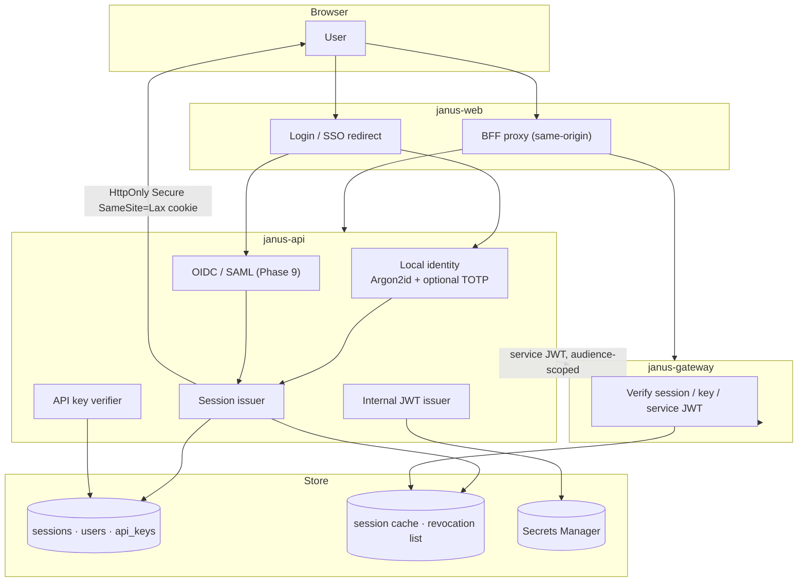
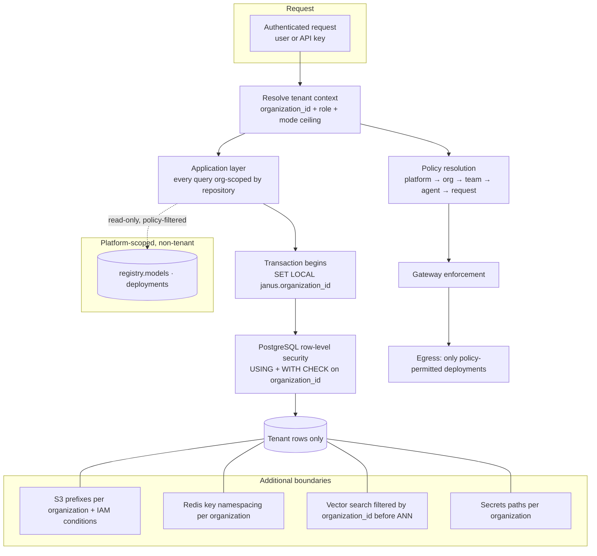

# Security Model

**Status:** Draft for review (Phase 0) · **Last updated:** 2026-08-13

Janus handles other organizations' confidential text and forwards some of it to third-party AI providers. The two central security problems are therefore **tenant isolation** and **controlling what leaves Janus**.

Related: [architecture.md](./architecture.md) · [model-gateway.md](./model-gateway.md) · [database.md](./database.md) · [api.md](./api.md)

---

## 1. Trust boundaries

```text
Untrusted            │ Semi-trusted        │ Trusted                │ External
─────────────────────┼─────────────────────┼────────────────────────┼──────────────────
Browser / client     │ janus-web (SSR)     │ janus-api              │ Cloud AI providers
User content         │ Public API callers  │ janus-gateway          │ MCP servers
Model output         │                     │ janus-worker           │ Customer webhooks
Tool output          │                     │ Aurora / Redis / S3    │
Uploaded documents   │                     │ janus-inference (EKS)  │
```

Four rules follow:

1. **The browser is never trusted for authorization.** Every decision is re-made server-side.
2. **Model and tool output are untrusted input.** They are data, never instructions, and never merged into a system prompt.
3. **The gateway is the only egress point to AI providers.** Everything crossing it is policy-checked.
4. **Provider credentials exist only in `janus-gateway`.** No other component can read them.

---

## 2. Authentication



| Credential | Lifetime | Storage | Revocation |
|-----------|----------|---------|------------|
| Session cookie | Sliding, absolute max (e.g. 30 days) | Hash in `core.sessions`; Redis cache | Row revoke + Redis revocation entry |
| API key `jsk_live_…` | Until revoked or expiry | **Argon2id hash only**; plaintext shown once at creation | `revoked_at`; cached deny-list |
| Service JWT | Minutes | Signed with a Secrets Manager key; audience per service | Short TTL; key rotation |
| MFA (TOTP) | Per login | Secret reference in Secrets Manager, never in Postgres | User-managed reset |
| OIDC/SAML assertion | Per login | Not stored | IdP-controlled |

Rules: constant-time comparison for key verification · no credential ever logged or echoed by any endpoint · password reset and email verification tokens are single-use and short-lived · CSRF tokens required on cookie-authenticated mutations · login and key verification are rate-limited per IP and per identity with lockout backoff.

---

## 3. Authorization

Roles at organization scope, plus resource-level checks. Authorization runs **before** any business logic and again at the data layer via RLS.

| Role | Capabilities |
|------|--------------|
| `owner` | Everything, including deletion and billing |
| `admin` | Members, policies, agents, keys, knowledge, usage |
| `member` | Chat, run permitted agents, create own agents and knowledge |
| `viewer` | Read-only within granted resources |
| `billing` | Usage and invoices only |
| *platform operator* | Janus staff: registry and deployment administration. **Not** a tenant role, and holds no access to tenant conversation content |

### 3.1 Permission matrix (representative)

| Action | owner | admin | member | viewer |
|--------|:-----:|:-----:|:------:|:------:|
| Chat in own conversations | ✅ | ✅ | ✅ | — |
| Read another user's conversation | — | — | — | — |
| Create / edit own agent | ✅ | ✅ | ✅ | — |
| Publish org-visible agent | ✅ | ✅ | ⚙️ | — |
| Edit organization policy | ✅ | ✅ | — | — |
| Create / revoke API keys | ✅ | ✅ | — | — |
| View org usage | ✅ | ✅ | own only | — |
| Register MCP server / tool | ✅ | ✅ | ⚙️ | — |
| Delete organization | ✅ | — | — | — |

⚙️ = organization-configurable. **Conversations are private to their creator by default**, including from admins; any org-wide access must be an explicit, audited, and user-visible setting.

### 3.2 API key scopes

`chat:write` · `models:read` · `agents:read` · `agents:run` · `agents:write` · `knowledge:read` · `knowledge:write` · `usage:read` · `admin:policies`

Keys additionally carry a `mode_ceiling`, so a key can be structurally incapable of causing external inference.

---

## 4. Secrets

| Secret | Location | Consumer |
|--------|----------|----------|
| Provider API keys (Sarvam, OpenAI, Anthropic, Gemini, Bedrock role) | AWS Secrets Manager | `janus-gateway` **only** |
| Database credentials | Secrets Manager, rotated | api, gateway, worker (least-privilege DB roles) |
| JWT signing keys | Secrets Manager, rotated | api (sign), gateway (verify) |
| Per-organization tool / MCP credentials | Secrets Manager, path-scoped per org | worker, runtime — resolved server-side, never in model context |
| Bring-your-own provider keys (Phase 9) | Secrets Manager, path-scoped per org | gateway only |

Rules: no secret in Git, environment files committed, container images, logs, error messages, or API responses · IAM policies scope each task role to its own secret paths · secrets are fetched at startup and on rotation, cached in memory only · CI runs secret scanning and fails on detection · `.env.example` files contain placeholders only.

---

## 5. Data classification

| Level | Meaning | Default routing constraint |
|-------|---------|---------------------------|
| `PUBLIC` | No confidentiality requirement | Any permitted deployment |
| `INTERNAL` | Ordinary business data (default) | Any permitted deployment |
| `CONFIDENTIAL` | Sensitive business data | Private deployments preferred; external only if the organization opts in |
| `RESTRICTED` | Regulated or contractually restricted (PHI, PCI, material non-public information, sensitive personal data) | **Janus-private only**; never external providers |

Classification is determined by, in precedence order: explicit request value → knowledge base or document classification in context → conversation setting → organization default. **The highest classification present in the request context wins.** Attachments and retrieved chunks can therefore raise a request's classification.

Phase 9 adds optional detection assistance (pattern-based PII/PCI signals) that can only **raise** classification, never lower it, and is advisory to the user rather than silently reclassifying.

---

## 6. Multi-tenancy



Shared-schema tenancy with RLS ([ADR 0005](./adr/0005-multi-tenancy-rls.md)). Defense in depth:

| Layer | Control |
|-------|---------|
| Application | Repository pattern; no raw cross-tenant queries; org context from the authenticated principal only, never a request body field |
| Database | RLS `USING` + `WITH CHECK`, `FORCE ROW LEVEL SECURITY`, application role without `BYPASSRLS` |
| Object storage | `s3://bucket/org_…/…` prefixes with IAM conditions; pre-signed URLs scoped and short-lived |
| Cache | `janus:{org_id}:…` key namespacing |
| Vectors | `organization_id` filter applied before/with ANN search |
| Secrets | Per-organization paths |
| Testing | Cross-tenant access tests per tenant table; a new tenant table without an RLS policy fails CI |

Enterprise customers requiring physical separation are served by a dedicated deployment, not by weakening this model — an open question in [database.md](./database.md#13-open-questions).

---

## 7. Policy engine

Policies express what an organization permits, and are enforced at the gateway before a provider is chosen.

| Expressible | Example |
|-------------|---------|
| Allowed / denied models | Only `sarvam-*` and `janus/*` |
| Allowed / denied providers | Deny all external commercial providers |
| Allowed regions / residency | US regions only (`us-east-1`, `us-west-2`) |
| Allowed data classifications per destination | `RESTRICTED` → private deployments only |
| Execution mode ceiling | `private` |
| Cost ceilings | Per request, per run, per period |
| Token ceilings | Max context, max output |
| External AI allowed | Boolean, with classification carve-outs |
| Fallback behavior | Cross-provider permitted or not |
| Tool constraints | Allowed tool kinds, approval requirements |

Worked example — a US financial services organization allows Janus-private deployments only and blocks all external commercial providers. A user asking a general question is served by a private deployment; if none is healthy, the request fails with `no_eligible_model` rather than silently reaching an external provider.

---

## 8. Policy resolution

```text
platform default  →  organization  →  team  →  agent  →  API key  →  request
```

| Element | Rule |
|---------|------|
| **Constraints** (privacy, mode, regions, allow/deny, classification rules) | **Most restrictive wins.** A narrower scope can never widen a broader one |
| **Preferences** (weight profile, weights, preferred models) | Most specific wins |
| **Limits** (cost, tokens) | Minimum of all applicable limits |
| **Mode** | Effective mode = most restrictive of all scopes; request may narrow only |
| Conflict | Deny beats allow, always |
| Auditability | The resolved policy plus each contributing policy version is recorded on the routing decision |

Resolution is a pure function of the policy set and request context — unit-testable, with property tests asserting that no combination ever widens a constraint.

---

## 9. Egress control

What may leave Janus, to whom, and with what:

| Control | Rule |
|---------|------|
| Destinations | Only registered provider endpoints; egress restricted at the network layer (no arbitrary outbound from the gateway) |
| Payload minimization | Only the messages, tools, and parameters needed for the completion. No internal identifiers beyond an opaque correlation id, no infrastructure detail, no other tenants' data |
| Credential isolation | One organization's bring-your-own key is used only for that organization's requests |
| Janus-hosted endpoints | Private subnets, no internet egress, mTLS or VPC-internal only |
| Provider data-retention posture | Recorded per provider in the registry and surfaced in the model catalog; providers with unacceptable retention are excluded from `CONFIDENTIAL`/`RESTRICTED` routing |
| Tool egress | `external_send` tools are classification-gated and default to human approval |
| Logging | Prompt and completion bodies are **not** written to application logs; sampled content capture (if ever enabled) is opt-in per organization and separately access-controlled |

---

## 10. Model and tool output handling

| Threat | Mitigation |
|--------|------------|
| Prompt injection via documents, web content, or tool results | Retrieved and tool content is wrapped and labeled as untrusted data; system instructions are never assembled from it; tool allow-lists mean injected text cannot invoke an unbound tool |
| Injection escalating privileges | Tools carry side-effect class and classification ceilings; `mutating` / `external_send` default to human approval |
| Chain-of-thought exposure | Internal reasoning is never returned by any API and never stored in message bodies; it lives in `agent_steps.scratchpad` with shorter retention and operator-only access |
| Unsafe content generation | Provider safety features plus Janus-side output policies; safety metrics tracked by the evaluation harness |
| Rendering attacks (XSS via Markdown, HTML, SVG) | Strict sanitization, no raw HTML execution, sandboxed rendering of artifacts |
| Data exfiltration via rendered links or images | Outbound reference policy in the renderer; no automatic fetching of model-authored URLs |
| Secret leakage in output | Redaction pass on known secret patterns before persistence and display |

---

## 11. Infrastructure security

| Layer | Control |
|-------|---------|
| Network | Private subnets for all compute; ALB the only ingress; security groups least-privilege; VPC endpoints for AWS services |
| Edge | CloudFront + WAF (managed rules, rate-based rules, bot control); TLS 1.2+ |
| Containers | Minimal base images, non-root, read-only root filesystem, no shell in production images, image scanning in CI, signed images |
| IAM | One task role per service; no wildcard resources; separate roles for migrations |
| EKS (GPU, Phase 8) | IRSA per workload, network policies, no public API server, node isolation for GPU pools, no internet egress from inference pods |
| Encryption | TLS in transit everywhere; KMS at rest for Aurora, S3, EBS, Secrets Manager; customer-managed keys optional (Phase 9) |
| Backups | Automated Aurora snapshots, PITR, tested restore runbook |
| Uploads | Size and type limits, malware scanning before processing, never executed, served only via short-lived pre-signed URLs |
| Dependencies | Pinned versions, lockfiles, SCA scanning, timely patching |
| Change management | Terraform-only infrastructure, peer-reviewed; no console changes in production |

---

## 12. Auditing

Recorded in `core.audit_events` (append-only): authentication events, key lifecycle, policy changes, membership and role changes, agent publish/archive, tool and MCP registration, knowledge base and document lifecycle, admin access to tenant-adjacent data, and data export or deletion.

Each entry carries actor, action, resource, IP, timestamp, and before/after where meaningful. Organization admins can read their own audit log via the API. Platform-operator actions are logged in a separate operator trail that tenants can be shown on request.

---

## 13. Privacy and compliance posture

| Item | Position |
|------|----------|
| Privacy claims | Only claims the infrastructure actually guarantees. "Data stays within Janus infrastructure" is used **only** for `private` deployments in private subnets with no external egress |
| Data residency | Enforced by deployment region filters; US-only residency is the default posture for the launch market, and other geographies are configuration rather than redesign |
| Sovereign mode | External providers structurally excluded; region-pinned Janus deployments only. Sold to US regulated buyers (healthcare, financial services, government-adjacent) as "your data never leaves infrastructure we operate" |
| Training on customer data | **Never**, without explicit opt-in per organization; the default is no training and no human review |
| Deletion | User deletion of conversations and documents removes content and derived chunks; verified erasure workflow for regulatory requests, including backups within the retention window |
| Subprocessors | Every AI provider is a subprocessor; the list is published and per-provider retention posture is documented |
| Certifications | SOC 2 Type II readiness targeted in Phase 9 as the US enterprise entry requirement, HIPAA with a BAA where healthcare demand appears; controls above are designed with that in mind, and **nothing is claimed before audit** |

---

## 14. Threat model summary

| Threat | Primary mitigation |
|--------|-------------------|
| Cross-tenant data access | RLS + application scoping + per-org storage and cache namespacing + tests |
| Stolen API key | Hashed storage, scopes, mode ceiling, rate limits, anomaly alerting, fast revocation |
| Malicious prompt injection | Untrusted-content framing, tool allow-lists, approval gates, classification ceilings |
| Provider compromise or misuse | Payload minimization, per-provider retention policy, private-only routing for sensitive data |
| Insider access to tenant content | Least-privilege operator roles without conversation access, audited operator trail |
| Credential leakage in logs | Structured logging with deny-lists, secret scanning, no prompt bodies in logs |
| Denial of service | WAF, rate limits, bulkheads, load shedding, cost ceilings |
| Supply chain | Pinned dependencies, SCA, image signing, safetensors-only weights, model security scans |
| Malicious model weights | Controlled onboarding pipeline, source verification, hash pinning, no arbitrary downloads in production |

---

## 15. Open questions

1. Identity: build local auth first, or adopt an external IdP (Cognito / Auth0 / WorkOS) immediately for SSO and MFA?
2. Should conversation content ever be visible to organization admins, and if so under what audited, user-visible mechanism?
3. Do we offer customer-managed KMS keys at launch or in Phase 9?
4. Is optional prompt/completion capture (for debugging and evaluation) acceptable at all, and if so with what default (recommendation: off, per-org opt-in, separately access-controlled)?
5. Compliance sequencing for the US market: SOC 2 Type II first (assumed), then HIPAA with a BAA, then state privacy laws (CCPA/CPRA) — is FedRAMP ever in scope, and does any design partner need ISO 27001?
6. Bring-your-own-key: which providers, and what is the isolation guarantee we are willing to state contractually?
